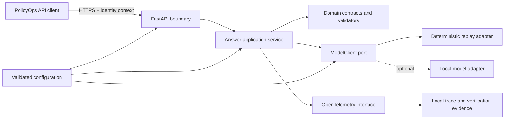
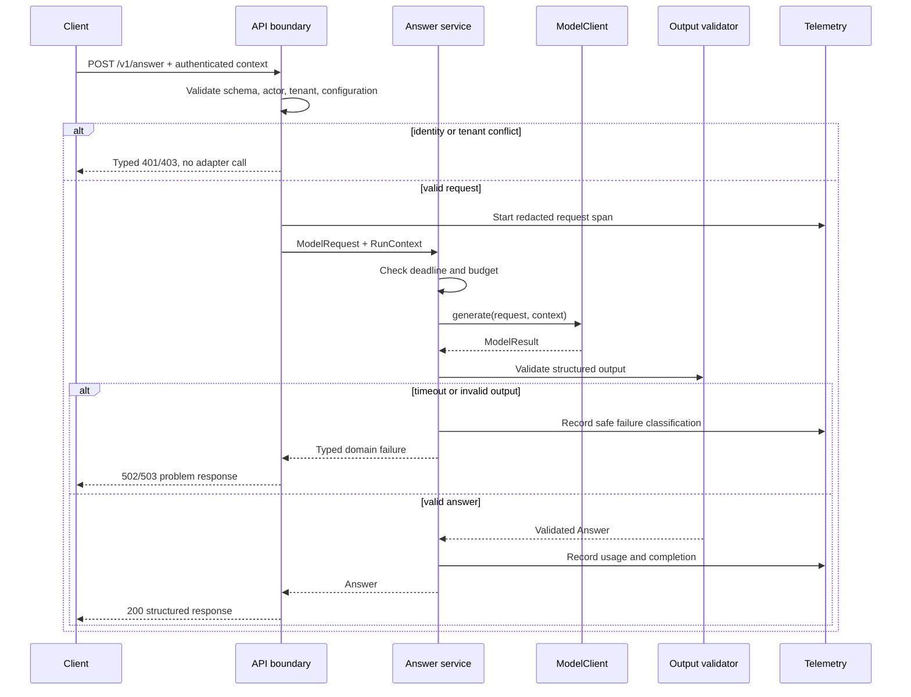

# Chapter 1 Architecture: PolicyOps Foundation

**PRD:** [Build the PolicyOps Foundation](./prd.md)

## Architecture goals and invariants

The foundation is a modular monolith with a deterministic application shell around a replaceable model port. It establishes contracts that later chapters can extend without rewriting the API.

The non-negotiable invariants are:

1. Tenant, actor, trace, configuration, deadline, and authorization context accompany every model call.
2. Provider types exist only inside adapter packages.
3. Model output is untrusted until schema and semantic validation succeed.
4. The replay profile is deterministic, offline, and mandatory; hosted and local profiles are optional.
5. Identity or tenant failure occurs before probabilistic work.
6. Secrets and raw sensitive content do not enter telemetry or evidence.

## System context



Only the API boundary is externally reachable. The replay adapter reads immutable fixture files. An optional adapter may access a local model process, but the application sees the same contracts.

## Components and responsibilities

| Component | Responsibility | Must not do |
|---|---|---|
| API boundary | Authenticate context, parse requests, map domain errors, publish OpenAPI | Import provider SDKs or trust body-supplied tenant identity |
| Answer service | Enforce deadline, call `ModelClient`, validate and return `Answer` | Perform retrieval, caching, tool calls, or provider-specific retries |
| Domain contracts | Define `RunContext`, requests, answers, citations, usage, and errors | Depend on FastAPI or SDK objects |
| Replay adapter | Select hashed fixture scenario and simulate success/failure | Read secrets or make network calls |
| Optional local adapter | Translate domain contracts to a local model API and back | Leak raw response objects into the application |
| Configuration loader | Validate profiles and compute a non-secret fingerprint | Log secret values or silently apply unsafe defaults |
| Telemetry facade | Create correlated spans and redacted events | Record raw classified content by default |
| Verification CLI | Orchestrate environment, tests, faults, and evidence | Hide a failed gate or require a hosted model |

## Interfaces and contracts

The domain port remains small and cancellation-aware:

```python
from typing import Protocol

class ModelClient(Protocol):
    async def generate(
        self, request: ModelRequest, context: RunContext
    ) -> ModelResult: ...
```

A representative request envelope is:

```json
{
  "schema_version": "1.0",
  "request_id": "req_fixture_001",
  "trace_id": "trace_fixture_001",
  "tenant_id": "tenant_alpha",
  "actor_id": "actor_reader",
  "roles": ["policy-reader"],
  "purpose": "policy-question",
  "configuration_id": "sha256:...",
  "configuration_versions": {"model": "replay-v1", "policy": "policy-v1"},
  "deadline_at": "2030-01-01T00:00:05Z",
  "budget": {"max_input_tokens": 2048, "max_output_tokens": 512},
  "data_classification": "internal",
  "authorization_context": {"scopes": ["policy:read"], "decision_id": "authz-fixture-1"},
  "approval_reference": null,
  "idempotency_key": null
}
```

This versioned type is the canonical identity, authorization, configuration, deadline, and budget envelope for every later chapter. Later components may derive narrower signed projections, but they may not invent a competing principal schema or silently drop fields. Any schema extension requires a new version plus backward-compatibility and adapter contract tests.

`ModelResult` is a discriminated success/failure union. Successful output contains a structured `Answer`; failure contains a stable code, retry classification, safe message, and upstream correlation token. Pydantic models reject missing mandatory fields and use explicit schema versions. Semantic validation checks that answer type, abstention reason, and citations are mutually consistent.

The replay adapter resolves `(fixture_pack_hash, scenario_id, configuration_id)` to canonical JSON. Tests can select faults through a test-only composition setting; the HTTP body cannot choose privileged fault behavior in normal mode.

## Data and storage

Chapter 1 requires no database. Immutable files hold replay scenarios, policy excerpts, expected OpenAPI, and contract snapshots. Process memory holds only per-request data and validated configuration. Verification writes disposable evidence under `build/ch01/`:

- `result.json` with gate outcomes and environment fingerprint;
- `junit.xml` for CI;
- redacted trace export;
- dependency and fixture hashes;
- configuration fingerprint and baseline scorecard.

Evidence output is not an application data store and is recreated on each run.

## Runtime sequence



## Security and trust boundaries

The client/API boundary is untrusted. Authenticated tenant and actor values come from the verified identity context, not request-body overrides. The API-to-domain boundary admits only validated domain models. The adapter boundary is also untrusted because model output may be malformed or adversarial.

Configuration uses environment references or mounted secret locations; it never serializes resolved secret values. Logging and span helpers use attribute allowlists. The container drops root privileges, uses a read-only application layer where practical, and exposes no model or debug port. The fixture profile denies network access during tests to prove offline behavior.

## Failure handling, recovery, and idempotency

The answer operation is read-only in this chapter, so retries cannot duplicate an external effect. Nevertheless, request and trace IDs remain stable across a caller retry. Deadline exhaustion cancels the adapter and maps to `DEADLINE_EXCEEDED`; malformed model output maps to non-success `MODEL_BAD_OUTPUT`; upstream capacity or availability maps to retry-classified `MODEL_CAPACITY`; unavailable configuration keeps readiness false. Unexpected exceptions map to a generic internal failure while preserving a server-side correlation ID.

The service performs no automatic cross-provider retry, which belongs to later routing and production chapters. Process restart is sufficient recovery because Chapter 1 has no durable state.

## Observability and evaluation boundaries

Required spans are `http.request`, `policyops.answer`, `model.generate`, and `answer.validate`. Allowed attributes include opaque tenant and actor IDs, trace/request IDs, adapter name, configuration fingerprint, status, duration, token counts, and safe error code. Prompt and output bodies are excluded.

Chapter 1 records deterministic contract results and a baseline latency/error scorecard. It does not assert semantic answer quality. Chapter 2 consumes the trace shape and adds task, trial, grader, and outcome evaluation.

## Deployment and local development

The target layout is:

```text
src/policyops/contracts/
src/policyops/api/
src/policyops/adapters/
tests/contract/
tests/api/
labs/ch01/manifest.toml
build/ch01/
```

Python 3.12+, `uv`, FastAPI, Pydantic, pytest, OpenTelemetry, and Docker Compose form the shared stack. Exact versions are locked at implementation kickoff. Local development defaults to the replay adapter. Docker Compose starts only the API and an optional local telemetry collector; no PostgreSQL or Redis is justified here. CI uses the same frozen install and verification command as local execution.

## Testing strategy

- **Schema tests:** accepted and rejected request, answer, citation, usage, and error examples.
- **Port contract tests:** one suite parametrized over replay and every enabled adapter.
- **API tests:** authentication context, tenant conflict, media type, status mapping, health, readiness, and OpenAPI snapshot.
- **Fault tests:** malformed JSON, missing answer fields, timeout, unavailable adapter, and startup misconfiguration.
- **Boundary tests:** forbid provider imports outside adapter packages and scan evidence for secrets.
- **Container tests:** non-root identity, health behavior, graceful shutdown, and restricted network for fixture mode.
- **Determinism tests:** canonical fixture response and evidence hashes under a fake clock.

## Architecture decisions and trade-offs

1. **Modular monolith first.** One service keeps the lab implementable while package boundaries preserve future extraction options.
2. **Replay adapter is mandatory.** It makes every reader and CI run reproducible; it cannot establish real-model quality.
3. **Strict domain boundary.** Translation adds code but prevents vendor lock-in and creates a stable test seam.
4. **No database or cache.** Neither is required for this read-only foundation; later chapters introduce storage for justified use cases.
5. **Fail closed on model output.** Returning a partial best effort would make downstream authorization and citations unsafe.
6. **Readiness is non-generative.** It avoids cost and flaky health probes at the expense of not proving full generation on every probe.

## Implementation sequence

1. Create schemas, stable error taxonomy, and canonical JSON helpers.
2. Define `ModelClient` and write adapter-independent contract tests.
3. Implement replay fixtures and deterministic fault simulation.
4. Build composition, startup validation, and configuration fingerprinting.
5. Implement answer, liveness, and readiness endpoints.
6. Add output semantics, error mapping, and redacted tracing.
7. Add optional local adapter behind the same tests.
8. Add container and verification workflow; perform fault drills and archive evidence.

## PRD requirement mapping

| Architecture element | PRD requirements |
|---|---|
| Domain envelope and contracts | CH01-FR-001, CH01-FR-002, CH01-SEC-005 |
| `ModelClient` and adapters | CH01-FR-003, CH01-FR-004, CH01-NFR-005 |
| API boundary and health | CH01-FR-005, CH01-FR-006, CH01-NFR-003 |
| Configuration and composition | CH01-FR-007, CH01-SEC-006 |
| Output validator and typed failures | CH01-FR-008, CH01-SEC-004 |
| Telemetry and evidence | CH01-FR-009, CH01-SEC-003 |
| Verification CLI and container | CH01-FR-010, CH01-NFR-001, CH01-NFR-006 |
| Canonical replay serialization and fixed fixture IDs | CH01-NFR-002 |
| Bounded fixture smoke and contract execution profile | CH01-NFR-004 |
| Pre-model identity and tenant authorization guard | CH01-SEC-001 |
| Secret-free configuration and runtime credential boundary | CH01-SEC-002 |

The resulting architecture hands Chapter 2 stable request, answer, trace, and error contracts on which to build release-grade evaluation.
