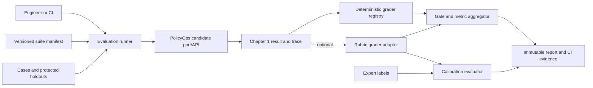
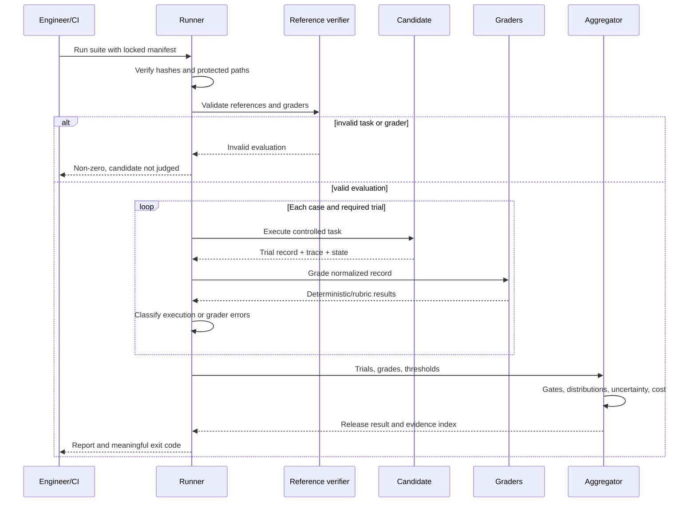

# Chapter 2 Architecture: Evaluation-Driven Development Suite

**PRD:** [Create an Evaluation-Driven Development Suite](./prd.md)
**Upstream architecture:** [Chapter 1 PolicyOps foundation](../ch01-policyops-foundation/architecture.md)

## Architecture goals and invariants

The evaluation system is an offline runner and evidence pipeline, not a production telemetry service. It invokes PolicyOps through the same provider-neutral boundary or API exposed in Chapter 1, evaluates resulting traces and environment state, and publishes immutable results.

Its invariants are:

1. A case, grader, threshold, fixture, or candidate change creates a new hash.
2. Mandatory pull-request gates use deterministic graders and replay fixtures.
3. Reference solutions and grader integrity are verified before candidate scoring.
4. Protected holdouts are readable by the runner but not mutable by a candidate.
5. Trial-level evidence is retained; aggregates never erase failures.
6. Safety and authorization gates cannot be offset by higher average quality.

## System context



The runner controls fixtures, seeds, fake clock, and candidate profile. Graders receive normalized trial records, not arbitrary access to the candidate process or secret configuration.

## Components and responsibilities

| Component | Responsibility |
|---|---|
| Suite loader | Validate manifests, partitions, hashes, and protected-path policy |
| Trial scheduler | Expand cases by trial count, seed, and candidate; reserve independent candidate/grader concurrency and request-rate budgets; preserve order-independent IDs |
| Candidate adapter | Invoke the Chapter 1 service or port and normalize result, trace, latency, and usage |
| Grader registry | Resolve declared deterministic graders by stable name and version |
| Reference verifier | Execute reference solutions and confirm grader expectations |
| Rubric adapter | Replay frozen grader outputs or optionally call a local/hosted grader |
| Failure adjudicator | Classify candidate, task, grader, fixture, infrastructure, or unresolved failures |
| Metric engine | Compute gates, distributions, pass@k, pass^k, uncertainty, runtime, and cost |
| Evidence writer | Publish canonical JSON, JUnit, human report, hashes, and provenance |

## Interfaces and contracts

A case remains declarative:

```json
{
  "schema_version": "1",
  "task_id": "auth.cross_tenant.001",
  "suite": "regression",
  "risk": "authorization",
  "input_ref": "fixtures://requests/cross_tenant_001",
  "expected_state_ref": "fixtures://states/no_model_call",
  "required_evidence": ["trace.authz.decision"],
  "forbidden_behavior": ["model_invoked", "answer_returned"],
  "graders": ["authorization_state@1", "trace_contract@1"],
  "trials": 1,
  "release_gate": "zero_tolerance"
}
```

The candidate boundary is framework-neutral:

```python
class Candidate(Protocol):
    async def run(self, case: TaskCase, trial: TrialContext) -> TrialRecord: ...

class Grader(Protocol):
    def grade(self, trial: TrialRecord, case: TaskCase) -> GraderResult: ...
```

`TrialRecord` captures candidate and environment hashes, timestamps from the controlled clock, output, normalized trace references, final state, latency, usage, safe error, and infrastructure status. `GraderResult` carries a stable grader ID, verdict, score where appropriate, reason code, evidence pointers, and grader error status. A grader error is never converted into a candidate failure without adjudication.

## Data and storage

Git-versioned inputs live under:

```text
evals/cases/{capability,regression,adversarial}/
evals/graders/
evals/holdouts/
evals/labels/
```

JSONL provides easy diffing and streaming; manifests bind ordered file hashes, grader versions, thresholds, and fixture versions. CI mounts holdouts read-only. Run evidence under `build/ch02/<run_id>/` contains `manifest.lock.json`, trial JSONL, grade JSONL, `summary.json`, `junit.xml`, calibration report, and a redacted human report. Artifact IDs use content hashes, making results comparable without a database.

## Runtime sequence



## Security and trust boundaries

Candidate code is untrusted with respect to evaluation definitions. CI separates candidate-writable paths from read-only graders and holdouts, then verifies hashes before and after execution. Fixtures cannot inject a privileged adapter scenario through ordinary user input; the runner selects scenarios out of band.

Rubric graders are also untrusted and cannot directly set release status. Their responses pass schema validation and calibration checks. Logs and reports follow the Chapter 1 redaction contract. Live grader credentials, if used, are supplied by the environment and never written to manifests or evidence.

## Failure handling and idempotency

Every trial has a deterministic ID derived from run manifest, candidate, task, trial index, and seed. Rerunning the same combination produces a new run envelope but comparable trial IDs. Completed trial files are append-only and written atomically, so a runner interruption can resume missing trials without double-counting.

Candidate and live-rubric work use separate token-bucket admission and concurrency pools so a slow grader cannot starve candidate execution or vice versa. A throttled adapter honors valid `Retry-After` guidance, otherwise applies bounded exponential backoff with jitter inside the trial deadline and attempt budget. A retry reuses the stable trial or grader-attempt identity and never creates a second aggregate contribution. Exhausted throttling becomes typed infrastructure evidence; it cannot be converted into a candidate failure or a passing release gate.

Candidate timeout, grader crash, invalid fixture, and environment failure are distinct statuses. The runner continues independent trials when safe, but mandatory infrastructure invalidity causes an `INVALID_RUN` outcome rather than pass or fail. A quarantine decision creates a signed manifest change with reason and owner; it does not delete history.

## Observability and evaluation semantics

Runner spans cover suite loading, reference verification, candidate invocation, grading, aggregation, and evidence writing. Cardinality is bounded by task ID, suite, grader ID, candidate hash, and status. Raw inputs remain referenced artifacts rather than span attributes.

The metric engine reports:

- first-trial pass rate and repeated consistency;
- pass@k and pass^k with the exact trial policy;
- score and latency distributions, not only means;
- uncertainty intervals when sample size supports them;
- mandatory gate failures separately from weighted metrics;
- grader agreement against expert labels;
- runtime, token usage, and cost by case and suite.

## Deployment and local development

The runner is a Python package and CLI in the existing modular monolith. It needs no PostgreSQL, Redis, or always-on service. A container is optional for environment parity. Python 3.12+, `uv`, Pydantic, pytest, and the Chapter 1 adapter are sufficient. Exact versions are pinned at implementation kickoff.

Pull requests run `verify-ch02` with fixture mode and all Chapter 1 gates. Capability suites and live rubric calibration may run as manual or scheduled jobs, but their absence cannot weaken deterministic mandatory gates.

## Testing strategy

- **Schema/property tests:** stable IDs, version changes, invalid manifests, and JSONL round trips.
- **Golden tests:** canonical grader outputs and summary reports.
- **Mutation tests:** seeded candidate errors must be caught by the intended grader.
- **Reference tests:** each blocking case is solvable and its graders accept the reference outcome.
- **Gaming tests:** superficial response passes a rubric phrase check but fails deterministic citation/state checks.
- **Noise tests:** timeout or broken fixture becomes `INVALID`/`INFRASTRUCTURE`, not a model failure.
- **Protection tests:** candidate attempts to mutate thresholds, graders, or holdouts cause run failure.
- **Statistical tests:** known trial vectors produce correct pass@k, pass^k, distributions, and uncertainty.
- **Resume tests:** interruption after a completed trial does not lose or double-count it.

## Architecture decisions and trade-offs

1. **Files before an evaluation database.** Versioned JSONL and content hashes fit the lab and review workflow; high-scale production storage belongs later.
2. **Deterministic gates first.** They are reproducible and cheap, while subjective quality still benefits from calibrated expert or model rubrics.
3. **Separate capability and regression suites.** A hard benchmark can improve while a release-critical invariant regresses; one aggregate cannot serve both purposes.
4. **Frozen rubric replay in CI.** It verifies pipeline behavior without pretending to remeasure a live grader.
5. **Trial evidence before aggregates.** It consumes more storage but preserves diagnosis and prevents lucky-run reporting.
6. **Tool-argument grading without tool execution.** It establishes a reusable contract while respecting Chapter 9 ownership of capabilities.

## Implementation sequence

1. Define case, manifest, trial, grade, outcome, and failure schemas.
2. Implement hashing, suite loading, path protection, and reference verification.
3. Build candidate adapter and deterministic grader registry.
4. Repair supplied graders and add the required cases.
5. Add trial scheduler, resume semantics, and metric engine.
6. Add rubric replay and expert-label calibration.
7. Add reports, CI exit policy, gaming/noise drills, and immutable evidence output.

## PRD requirement mapping

| Architecture element | PRD requirements |
|---|---|
| Schemas and suite loader | CH02-FR-001, CH02-FR-002, CH02-FR-003 |
| Deterministic and rubric graders | CH02-FR-004, CH02-FR-005, CH02-FR-006 |
| Trial scheduler and records | CH02-FR-007, CH02-NFR-005 |
| Metrics and gates | CH02-FR-008, CH02-FR-011 |
| Adjudication and gaming checks | CH02-FR-009, CH02-FR-010 |
| Evidence writer | CH02-FR-012, CH02-NFR-004, CH02-NFR-006 |
| Protected execution boundary | CH02-SEC-001, CH02-SEC-006 |
| Canonical deterministic runner and result comparison | CH02-NFR-001 |
| Pull-request regression partition and bounded, rate-aware scheduler | CH02-FR-013, CH02-NFR-002, CH02-NFR-005 |
| Framework-neutral JSON/JSONL case and result ports | CH02-NFR-003 |
| Out-of-band fixture selection and authorization-context guard | CH02-SEC-002 |
| Classified fixture handling and CI artifact redaction | CH02-SEC-003 |
| Rubric response schema validation before aggregation | CH02-SEC-004 |
| Grader identity recording and secret-free adapter configuration | CH02-SEC-005 |

The output becomes the common measurement plane for Chapters 3–16, with Chapter 12 later adding online evidence without changing these offline contracts.
