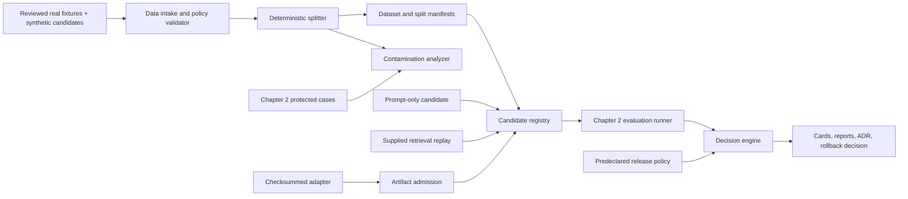
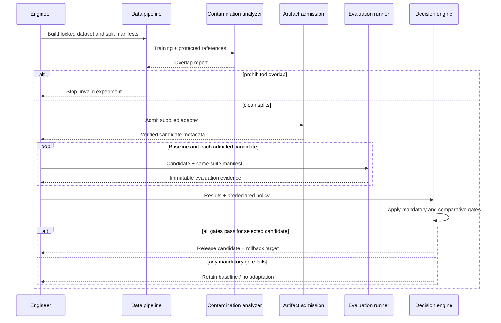

# Chapter 3 Architecture: Adaptation Decision Pipeline

**PRD:** [Choose the Right Adaptation Strategy](./prd.md)
**Upstream architecture:** [Chapter 2 evaluation suite](../ch02-evaluation-driven-development-suite/architecture.md)

## Architecture goals and invariants

This project is an offline, manifest-driven decision pipeline. It assembles data and candidate lineage, verifies admission requirements, runs all candidates through the Chapter 2 evaluation interface, and produces a policy-enforced decision. It does not modify the running PolicyOps service or build production retrieval/serving infrastructure.

Invariants:

1. No record without provenance and rights metadata enters a dataset manifest.
2. Train/validation data cannot overlap protected evaluation data under declared contamination checks.
3. Every candidate shares the same task, grader, trial, and outcome contracts.
4. Thresholds and protected artifacts are fixed before candidate evaluation.
5. Artifact identity is content-based; a changed dataset, prompt, checkpoint, or configuration is a new candidate.
6. Any mandatory gate failure yields no release, regardless of average gain.

## System context



The optional trainer consumes the same locked training manifest and publishes another candidate into the registry. It is not on the required core path.

## Components and responsibilities

| Component | Responsibility |
|---|---|
| Data intake | Validate record schema, provenance, rights, consent, sensitivity, and deletion metadata |
| Synthetic-data recorder | Capture generator inputs/configuration, filters, review status, and parent lineage |
| Deterministic splitter | Assign stable entity/group-based train, validation, and protected partitions |
| Contamination analyzer | Compare training against evaluation/protected records using multiple detectors |
| Artifact admission | Verify checkpoint hash, format, source, license, base model, and safe loading |
| Candidate registry | Normalize baseline, prompt, retrieval-replay, adapter, and optional trained candidate configurations |
| Evaluation bridge | Invoke Chapter 2 suites and retain immutable run evidence |
| Regression analyzer | Compare quality, safety, subgroup, calibration, latency, usage, and cost deltas |
| Decision engine | Apply zero-tolerance and threshold policies and emit release/no-release record |
| Card generator | Produce dataset/model cards and adaptation ADR from validated evidence |

## Interfaces and contracts

Representative lineage contracts are:

```python
class DataRecord(BaseModel):
    record_id: str
    content_hash: str
    source_ref: str
    rights_basis: str
    consent_ref: str | None
    sensitivity: str
    owner: str
    derived_from: list[str]
    deletion_scope: list[str]

class AdaptationCandidate(BaseModel):
    candidate_id: str
    kind: Literal["baseline", "prompt", "retrieval_replay", "adapter"]
    model_ref: str
    artifact_hashes: dict[str, str]
    configuration_hash: str
    rollback_target: str
```

A release policy remains data, not code embedded in candidate logic:

```yaml
policy_version: 1
baseline: ch02-baseline
gates:
  protected_overlap: {operator: eq, value: 0, mandatory: true}
  authorization_regressions: {operator: eq, value: 0, mandatory: true}
  safety_regressions: {operator: eq, value: 0, mandatory: true}
  subgroup_min_pass_rate: {operator: gte, value: 0.90, mandatory: true}
  latency_delta_pct: {operator: lte, value: 20, mandatory: true}
decision_on_any_mandatory_failure: retain_baseline
```

Numerical values are illustrative fixture policy and must be locked at implementation kickoff. The decision engine reads results but cannot change thresholds. `ReleaseDecision` includes every gate, evidence references, selected candidate, no-release reason, rollback target, reviewer role, and expiration.

## Data and storage

Inputs and outputs are file-based and content-addressed:

```text
data/manifests/
data/records/
models/cards/
models/artifacts/        # supplied approved artifact or external verified reference
src/policyops/adaptation/
tests/adaptation/
docs/adrs/
build/ch03/
```

Large artifacts need not be committed; their manifest records an approved location, hash, size, format, license, and retrieval procedure. Protected Chapter 2 data is mounted read-only. Reports contain IDs and aggregate values, while sensitive record contents stay in controlled fixture locations. No database is necessary for the bounded experiment.

## Runtime sequence



## Security and trust boundaries

Source records and model artifacts are untrusted inputs. Intake policy excludes unsupported rights and incomplete provenance. Content is never interpolated into commands or logs. Checkpoints load through a format allowlist with arbitrary-code execution disabled, in an isolated test process where feasible.

Candidate execution cannot write evaluation cases, graders, thresholds, or protected splits. CI verifies hashes before and after evaluation. Optional training credentials or artifact-store tokens come from ephemeral environment injection and never enter cards or manifests. Deletion lineage connects source IDs to derived dataset versions so future rebuilds can honor removals.

## Failure handling, recovery, and idempotency

Each pipeline stage writes its output atomically under a run ID derived from manifest hashes. A restart reuses valid immutable stage artifacts and recomputes incomplete stages. A candidate crash or load failure becomes an admission/evaluation failure, not a partial score. If any input hash changes during a run, the pipeline invalidates the run.

Release decisions are append-only. Reconsideration after a gate or data change creates a new decision that references the superseded record. Since the project has no production mutation, rollback means retaining or restoring the Chapter 1 baseline configuration rather than reversing an online deployment.

## Observability and evaluation

Pipeline spans cover intake validation, split generation, each contamination detector, artifact admission, candidate evaluation, gate application, and card generation. Attributes contain artifact IDs, counts, durations, status, and safe rule codes—not raw data.

The Chapter 2 suite remains authoritative for task outcomes. Chapter 3 adds dataset health, overlap counts, subgroup slices, calibration deltas, checkpoint verification, latency/cost comparison, and release-policy outcomes. The evidence pack binds both layers through suite and candidate hashes.

## Deployment and local development

Python 3.12+, `uv`, Pydantic, pytest, and the Chapter 2 evaluation runner are required. The core runs on CPU with supplied adapter and replay artifacts. PostgreSQL and Redis are unjustified. Optional adapter retraining uses a separate profile that declares accelerator type, memory, driver/runtime, seed, trainer configuration, and duration.

CI runs the fixture profile, protected-hash checks, contamination drills, supplied checkpoint admission, candidate comparison, and earlier chapter gates. Exact libraries and model serialization formats are pinned at implementation kickoff.

## Testing strategy

- **Record-policy tests:** missing rights, provenance, owner, sensitivity, and deletion metadata.
- **Split tests:** deterministic membership and entity/group isolation.
- **Contamination tests:** exact duplicate, normalized duplicate, near duplicate, and known false positive.
- **Admission tests:** wrong hash, unsupported format, mismatched base model, invalid license metadata, and safe load.
- **Candidate contract tests:** baseline, prompt, retrieval replay, and adapter expose identical evaluation behavior.
- **Gate tests:** mandatory safety failure overrides aggregate improvement.
- **Reproducibility tests:** two manifest runs produce equal split and deterministic result hashes.
- **Optional training tests:** resulting checkpoint is a new artifact with complete hardware and lineage metadata.

## Architecture decisions and trade-offs

1. **Decision pipeline, not training platform.** This keeps the core implementable and centers the harder release judgment.
2. **Supplied retrieval replay.** It compares the intervention class without duplicating Chapter 6 infrastructure.
3. **File/content-addressed lineage.** It is auditable and Git-friendly for the lab; Chapter 12 later provides a system registry.
4. **Group-aware deterministic splits.** They reduce leakage at the expense of perfectly balanced row counts.
5. **No weighted override of mandatory gates.** This can reject an otherwise better candidate but preserves safety and authorization invariants.
6. **Optional GPU retraining.** Readers can reproduce the training path without making hardware a prerequisite.

## Implementation sequence

1. Define record, manifest, artifact, candidate, run, and decision schemas.
2. Implement intake policy and deterministic group-aware splitting.
3. Implement contamination detectors and protected-path enforcement.
4. Implement checkpoint admission and normalized candidates.
5. Bridge candidates to the Chapter 2 runner and lock the baseline.
6. Add regression analysis, policy engine, cards, and ADR generation.
7. Execute seeded contamination and safety drills; archive the decision evidence.

## PRD requirement mapping

| Architecture element | PRD requirements |
|---|---|
| Intake and lineage schemas | CH03-FR-001, CH03-FR-002, CH03-FR-003 |
| Split and contamination pipeline | CH03-FR-004, CH03-FR-005, CH03-SEC-002 |
| Candidate registry and admission | CH03-FR-007, CH03-FR-008, CH03-SEC-004 |
| Evaluation bridge | CH03-FR-006, CH03-NFR-005 |
| Regression and decision engines | CH03-FR-009, CH03-FR-010, CH03-FR-012 |
| Optional trainer | CH03-FR-011, CH03-NFR-001 |
| Evidence and cards | CH03-NFR-003, CH03-SEC-006 |
| Content-addressed manifest stages and reproducible run identity | CH03-NFR-002 |
| Rule-coded validation with redacted record diagnostics | CH03-NFR-004 |
| Bounded CPU core and isolated optional-training profile | CH03-NFR-006 |
| Provenance, rights, and consent admission policy | CH03-SEC-001 |
| Synthetic and preprocessing secret/PII exclusion controls | CH03-SEC-003 |
| Read-only evaluation definitions and protected split boundary | CH03-SEC-005 |

Chapter 4 consumes the selected profile and the unchanged Chapter 2 gates to optimize inference behavior without reopening this adaptation decision.
