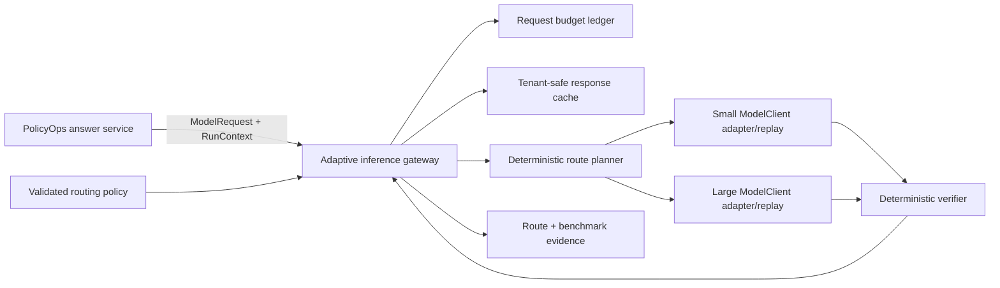
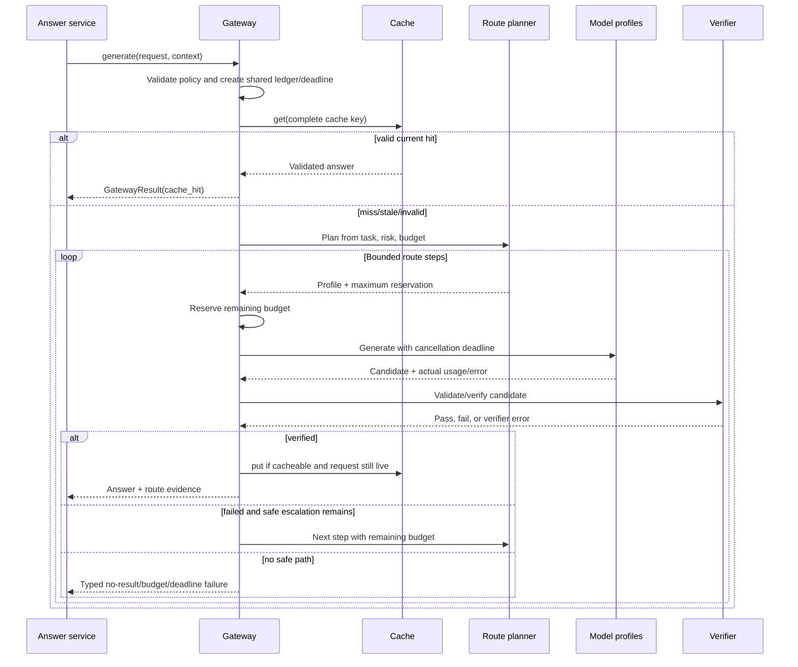

# Chapter 4 Architecture: Adaptive Inference Gateway

**PRD:** [Build an Adaptive Inference Gateway](./prd.md)
**Upstream measurement:** [Chapter 2 evaluation architecture](../ch02-evaluation-driven-development-suite/architecture.md)
**Downstream context:** [Chapter 5 context planner](../ch05-context-planner/architecture.md)

## Architecture goals and invariants

The gateway implements the existing Chapter 1 `ModelClient` port, so callers do not depend on routing internals. A deterministic policy chooses a bounded plan, a shared ledger enforces the total request budget, and a verifier decides whether to stop or escalate.

Invariants:

1. Deadline and budgets apply across all attempts, candidates, verification, and cache work.
2. Routing is quality/policy driven; provider health and fleet failover are out of scope.
3. Every returned answer, including a cache hit, passes current validation.
4. Cache identity includes tenant, effective authorization, model, prompt/context, configuration, schema, and source freshness.
5. Late/cancelled work cannot return or populate cache.
6. Fixture results are reproducible; hardware-specific results carry their environment and never become universal claims.

## System context



The core cache is process-local. It is a port so a later shared implementation can be benchmarked without changing key or validation semantics.

## Components and responsibilities

| Component | Responsibility |
|---|---|
| Gateway facade | Implement `ModelClient`, establish deadline/ledger, coordinate cache and route execution |
| Policy loader | Validate route graph, limits, allowed profiles, and hard ceilings |
| Task classifier | Map trusted request metadata to a declared task/risk class |
| Route planner | Select direct, bounded-candidate, or escalation steps with reason codes |
| Budget ledger | Reserve and debit token, time, candidate, and spend allowances atomically |
| Candidate executor | Invoke one profile, propagate cancellation, and normalize usage/errors |
| Verifier | Apply schema and task-specific deterministic checks and rank valid candidates |
| Cache port | Get/put validated entries under complete keys and TTL/freshness rules |
| Benchmark runner | Replay a locked workload and emit raw rows plus comparisons |

## Interfaces and contracts

Core contracts are provider-neutral:

```python
class BudgetLedger(Protocol):
    def reserve(self, estimate: CostEstimate) -> Reservation: ...
    def commit(self, reservation: Reservation, actual: Usage) -> None: ...
    def remaining(self) -> InferenceBudget: ...

class CandidateVerifier(Protocol):
    def verify(self, candidate: Candidate, request: ModelRequest) -> VerificationResult: ...

class ResponseCache(Protocol):
    async def get(self, key: CacheKey, now: datetime) -> CacheEntry | None: ...
    async def put(self, key: CacheKey, entry: CacheEntry) -> None: ...
```

The key is derived, never concatenated from raw user text:

```json
{
  "tenant": "sha256:...",
  "authorization": "sha256:effective-scopes-and-resource-policy",
  "semantic_request": "sha256:canonical-request",
  "model_profile": "small-fixture@config-hash",
  "prompt_context": "sha256:...",
  "inference_policy": "sha256:...",
  "source_freshness": "version:fixture-v1",
  "answer_schema": "1"
}
```

`RouteDecision` records selected steps, trigger/reason codes, maximum candidates, verifier, fallback, and initial budget. It excludes internal provider secrets and cannot increase permissions or hard ceilings from `RunContext`.

## Data and storage

The core uses an in-memory cache with bounded entries and deterministic fake-clock expiry. Cached values include the validated answer, key fields/hashes, creation/expiry, validator version, and safe provenance. Raw provider response objects are never cached.

Routing configuration is versioned under `config/routing.yaml`. Benchmark outputs under `build/ch04/` include locked workload manifest, per-request JSONL, cold/warm summaries, Pareto data, plot, and serving ADR. The build directory is disposable; the accepted evidence hashes are registered for the capstone.

No PostgreSQL or Redis is required. A shared cache is an optional later adapter only after it passes identical isolation and freshness tests.

## Runtime sequence



## Security and trust boundaries

Policy and task class use validated server-side configuration and authenticated context. Untrusted request text cannot directly select an unlimited route. The gateway caps any tenant-configured values with service hard limits.

Models, verifiers, and cache storage are separate trust boundaries. Model and cached outputs pass the current schema and semantic validator. Sensitive classifications bypass cache. Cache keys use effective authorization state and cryptographic hashes; trace output records only safe identifiers. An optional external cache requires authenticated encrypted transport and server-side tenant controls, but is not part of the core.

## Failure handling, recovery, and idempotency

The budget ledger reserves worst-case allowance before each invocation and commits actual usage afterward. If an adapter does not report usage, the conservative reservation remains consumed. A verifier exception is not a pass; policy may attempt a different deterministic verifier/fallback only if explicitly configured.

Timeout cancels outstanding work and marks the request closed. Completion callbacks check that state before cache writes. Stale, corrupt, or incompatible cache entries are evicted and treated as misses, while repeated corruption can fail the request under strict policy. Because generation has no external side effect, a caller may retry with the same request ID, but the gateway does not promise identical live-model text—only budget and contract behavior.

## Observability and evaluation

Spans include `gateway.request`, `cache.lookup`, `route.plan`, `candidate.generate`, and `candidate.verify`. Safe attributes record route/policy/profile hashes, task class, cache status, candidate index, remaining budget, duration, token/spend units, verifier status, and error code. No raw prompt or answer is required.

The benchmark runner invokes the Chapter 2 suite for each serving profile, using identical tasks and gates. It reports raw per-request outcomes, distributions, cold/warm cache separation, total fixture spend, quality-floor status, and Pareto-efficient candidates. An accepted ADR must explain the declared workload and why the selected profile is preferred.

## Deployment and local development

Implementation resides under `src/policyops/model_gateway/` and composes behind the Chapter 1 port. The fixture profile uses two replay adapters, fake clock, seeded workload, and local memory cache. Python 3.12+, `uv`, Pydantic, pytest, OpenTelemetry, and the existing API stack are sufficient.

CI runs `verify-ch04` plus Chapters 1–3 gates and emits JSON/JUnit/trace/dependency/fixture/configuration/hardware evidence. Optional hardware experiments run in a separate profile with exact device, runtime, concurrency, cache state, warm-up, and raw measurements.

## Testing strategy

- **Policy tests:** invalid route graphs, ceiling violations, unauthorized model/profile selection.
- **Ledger tests:** reservations, actual usage, failed attempts, concurrent accounting, and exhaustion.
- **Route tests:** easy direct, verification escalation, high-risk escalation, and no-budget termination.
- **Cache tests:** tenant/authorization/configuration/schema/freshness isolation, expiry, corruption, and sensitivity bypass.
- **Cancellation tests:** timeout before/during/after model return and no late cache write.
- **Verifier tests:** pass, fail, error, and deterministic ranking ties.
- **Benchmark tests:** locked workload, cold/warm separation, correct Pareto calculation, and retained Chapter 2 gates.
- **Contract tests:** gateway works wherever a Chapter 1 `ModelClient` is expected.

## Architecture decisions and trade-offs

1. **Gateway implements the existing model port.** This preserves callers but makes the gateway responsible for accurate aggregated usage.
2. **Deterministic core routing.** Explainability and repeatability outweigh an agentic router in this chapter.
3. **Conservative reservation ledger.** It may underutilize a budget but prevents runaway inference.
4. **In-memory cache first.** It proves semantics without an external dependency; it does not test distributed consistency.
5. **Validate cache hits.** Additional CPU cost protects against old schema, corruption, and stale unsafe output.
6. **No provider-health routing.** This cleanly separates request optimization from Chapter 14 availability operations.

## Implementation sequence

1. Define policy, route, budget, candidate, verifier, and cache contracts.
2. Implement hard limits, ledger, direct path, and trace evidence.
3. Add candidate generation, deterministic verification, and early exit.
4. Add quality-driven small-to-large route graph.
5. Add complete cache identity, expiry, validation, and cancellation guards.
6. Build locked benchmark runner, reports, Pareto analysis, and ADR.
7. Execute stale-cache, verifier, timeout, and budget drills and archive evidence.

## PRD requirement mapping

| Architecture element | PRD requirements |
|---|---|
| Contracts and gateway facade | CH04-FR-001, CH04-FR-002, CH04-NFR-003 |
| Direct and candidate execution | CH04-FR-003, CH04-FR-004 |
| Route planner and ledger | CH04-FR-005, CH04-FR-006, CH04-SEC-004 |
| Cache port and key builder | CH04-FR-007, CH04-FR-008, CH04-SEC-001, CH04-SEC-003 |
| Telemetry | CH04-FR-009, CH04-SEC-002 |
| Benchmark runner and ADR | CH04-FR-010, CH04-FR-011, CH04-NFR-004 |
| Hardware extension profile | CH04-FR-012, CH04-NFR-005 |
| Shared request deadline and bounded termination controller | CH04-NFR-001 |
| Replay profiles, seeded workload, and fake-clock route harness | CH04-NFR-002 |
| Cancellation state and late-result cache-write guard | CH04-NFR-006 |
| Current schema and semantic validation for model/cache outputs | CH04-SEC-005 |
| Corrupt-entry rejection and fail-closed verifier policy | CH04-SEC-006 |

The gateway hands Chapter 5 a selected inference profile and a cache interface; Chapter 5 supplies deterministic prompt/context fingerprints without owning cache storage or invalidation.
