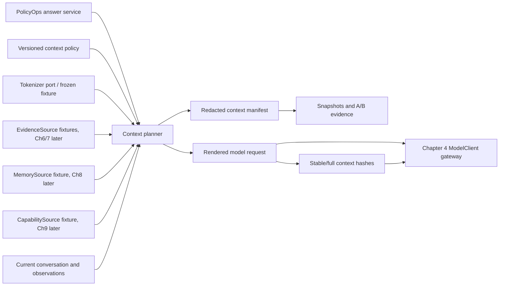
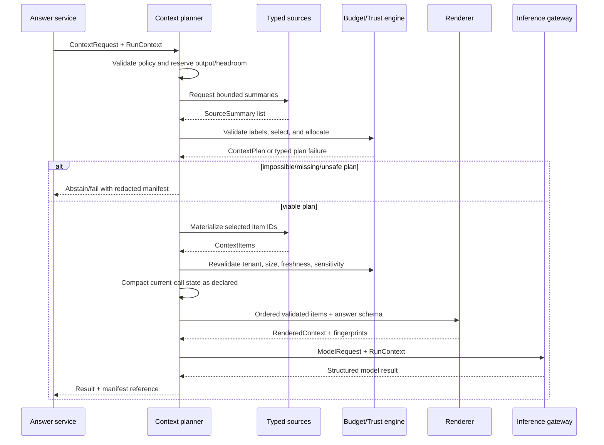

# Chapter 5 Architecture: Deterministic Context Planner

**PRD:** [Build a Context Planner](./prd.md)
**Upstream inference:** [Chapter 4 adaptive gateway](../ch04-adaptive-inference-gateway/architecture.md)

## Architecture goals and invariants

The planner is a pure application component between PolicyOps request handling and the provider-neutral `ModelClient`. It plans before it renders: source summaries are inspected, budgets allocated, selected items materialized and validated, then ordered into a model request. Every decision appears in a redacted manifest.

Invariants:

1. Authority and trust are typed metadata, not inferred from the text itself.
2. Selection, compaction, and rendering cannot increase an item's authority.
3. Required content is either present in full/approved compact form or the call does not proceed.
4. Source material is tenant-, sensitivity-, freshness-, schema-, and size-validated.
5. Fixed inputs produce stable manifests, snapshots, and context fingerprints.
6. The planner assembles current-call context only; it does not own source storage or capability execution.

## System context



Solid source arrows represent fixture adapters in the core. Later chapters replace them behind the same ports without changing planner ownership.

## Components and responsibilities

| Component | Responsibility |
|---|---|
| Context policy loader | Validate authority order, per-layer budgets, hard limits, compaction and stable-prefix rules |
| Source registry | Resolve allowed typed sources and collect cheap summaries |
| Trust validator | Check tenant, provenance, freshness, sensitivity, authority, schema, and size |
| Relevance selector | Rank summaries against declared task needs using deterministic fixture rules |
| Budget allocator | Reserve output/headroom, assign per-layer limits, and detect impossible plans |
| Materializer | Fetch selected content under source-call/byte/time limits and revalidate it |
| Compactor | Reduce current-call history/tool fixtures while preserving required structured facts |
| Observation normalizer | Convert the supplied image/table observation into a typed text/region record with provenance, trust, sensitivity, and token estimate |
| Ordering engine | Enforce authority/trust order, attention placement, and stable-before-variable layout |
| Renderer | Produce the model request with structured-answer contract and safe delimiters |
| Manifest writer | Record redacted decisions, counts, hashes, reason codes, and fingerprints |

## Interfaces and contracts

Typed sources separate discovery from materialization:

```python
class ContextSource(Protocol):
    async def summaries(
        self, request: ContextRequest, run: RunContext
    ) -> list[SourceSummary]: ...

    async def materialize(
        self, item_id: str, run: RunContext
    ) -> ContextItem: ...

EvidenceSource = ContextSource
MemorySource = ContextSource
CapabilitySource = ContextSource
```

The aliases signal semantic roles; implementation registration assigns allowed authority ceilings. For example, a `MemorySource` item may inform personalization but can never satisfy verified-evidence or policy authority.

An item contract includes:

```json
{
  "item_id": "evidence.policy.42",
  "source_kind": "evidence",
  "authority": "verified_evidence",
  "trust": "untrusted_content",
  "provenance": {"source_id": "policy-v3", "content_hash": "sha256:..."},
  "tenant_id": "tenant_alpha",
  "sensitivity": "internal",
  "fresh_until": "2030-01-01T00:00:00Z",
  "required": true,
  "stable": false,
  "estimated_tokens": 180
}
```

`ContextManifest` contains policy/tokenizer/model/configuration hashes; requested and actual budgets; included, compacted, excluded, and rejected item records; stable-prefix/full hashes; and terminal reason. Raw item text is absent by default.

## Data and storage

Core fixtures live under `fixtures/context/` with immutable hashes and expected snapshots, including the synthetic image/table observation and tool-overload case. Policy resides in `config/context_policy.yaml`. Tests and implementation live in `tests/context/` and `src/policyops/context/`. Evidence under `build/ch05/` includes redacted manifests, snapshots containing only approved synthetic fixture text, token reports, stable-prefix reports, and A/B outcomes.

The planner has no durable database. It operates on one request and discards materialized text afterward. Conversation inputs are supplied current-call records, not long-term memory. A small request-local memo may prevent duplicate source materialization, but it is not the Chapter 4 response cache or a persistent source cache.

## Runtime sequence



## Security and trust boundaries

All source adapters and source content are untrusted. Registration assigns a maximum authority per source kind; a returned label above that ceiling fails validation. Tenant and effective authorization come from `RunContext`, never from source text. Materialization rechecks metadata because summaries may be stale or compromised.

Content uses explicit delimiters and instruction/data separation, but prompt formatting is defense in depth rather than authorization. Only deterministic application code can grant policy, approval, or capability scope. A secret scanner and sensitivity policy run before rendering. Redacted manifests use allowlists and hashes. Snapshot tests use synthetic content only.

## Failure handling and idempotency

Planning is side-effect free. Each source call has a count, byte, and time limit. A failed optional source is excluded with a reason; a failed required source yields a typed no-call outcome. Token estimation overflow, materialized-size expansion, missing fact, high-authority conflict, or sensitivity mismatch prevents generation.

If actual token count exceeds the estimate tolerance, the planner may apply one deterministic compaction pass to optional/current-call state and recount. It may not silently slice required text or recursively call a model. Because input hashes and policy are stable, retrying fixture mode produces the same plan and manifest.

## Observability and evaluation

Spans include `context.plan`, `source.summaries`, `source.materialize`, `context.compact`, and `context.render`. Safe attributes record policy/source/item IDs, authority/trust/sensitivity classes, counts, token estimates/actuals, decisions, compaction strategy, fingerprints, duration, and terminal code. Raw content and secrets are excluded.

The A/B runner evaluates the supplied monolith and planned context with identical Chapter 2 tasks and Chapter 4 serving profile. It reports input tokens, required-evidence retention, stable-prefix match/reuse opportunity, latency, pass rate, and every mandatory gate. A lower token count is accepted only if the release suite does not regress.

## Deployment and local development

The planner is an in-process module and does not justify a service, PostgreSQL, or Redis. Python 3.12+, `uv`, Pydantic, pytest, OpenTelemetry, and the existing FastAPI application compose it locally. The fixture profile supplies tokenizer and source adapters and blocks network access.

Exact library versions and tokenizer artifacts are pinned at implementation kickoff. CI runs `verify-ch05` and all earlier regression gates, writes JSON/JUnit/trace/fixture/configuration evidence, and checks that secret markers never appear in build output.

## Testing strategy

- **Schema/policy tests:** invalid authority order, negative budgets, missing reserve, and unsupported source registration.
- **Trust tests:** source authority elevation, tenant mismatch, stale item, unauthorized sensitivity, and injected instructions.
- **Budget property tests:** generated item sets never exceed hard limits; required overflow yields explicit failure.
- **Compaction tests:** decisions, constraints, unresolved items, and artifact pointers survive; bulky observations are removed.
- **Ordering tests:** high-authority stable layers precede variable content and distractors cannot displace required evidence.
- **Snapshot tests:** deterministic plans, manifests, renders, and fingerprints.
- **Fault drills:** secret, conflict, oversized tool fixture, tool overload, missing fact, lost-in-middle, and silent truncation.
- **Normalization tests:** image/table observation coordinates, provenance, authority/trust labels, budget accounting, and embedded-instruction isolation.
- **A/B tests:** token reduction with unchanged Chapter 2 mandatory outcomes.
- **Adapter contract tests:** alternate tokenizer/source implementations preserve semantics.

## Architecture decisions and trade-offs

1. **Plan before render.** It adds a planning model but makes omissions and budget failure explicit.
2. **Typed source summaries plus lazy materialization.** This saves context and source work while requiring two-phase source contracts.
3. **Deterministic core selection and compaction.** It is reproducible and safe for the lab; model-assisted summaries can be a separately evaluated extension.
4. **Authority ceilings by source kind.** This prevents self-asserted trust even if an adapter is compromised.
5. **Manifest stores hashes, not content.** It protects privacy but requires authorized source access for deep incident review.
6. **Planner emits cache fingerprints, not cache decisions.** Chapter 4 retains cache ownership and invalidation semantics.

## Implementation sequence

1. Define source, item, plan, manifest, compaction, and rendered contracts.
2. Implement policy validation, authority ceilings, tokenizer port, and budget allocation.
3. Add fixture source summaries, deterministic selection, and lazy materialization.
4. Add metadata revalidation, current-call compaction, and typed failure paths.
5. Implement ordering, safe rendering, structured-answer binding, and fingerprints.
6. Add telemetry, snapshots, token/prefix reports, and A/B runner.
7. Run all drills and archive redacted evidence.

## PRD requirement mapping

| Architecture element | PRD requirements |
|---|---|
| Contracts and policy loader | CH05-FR-001, CH05-FR-002, CH05-FR-003 |
| Source registry/materializer | CH05-FR-004, CH05-FR-006, CH05-SEC-005 |
| Tokenizer and budget allocator | CH05-FR-005, CH05-NFR-004, CH05-NFR-005 |
| Compactor | CH05-FR-007, CH05-SEC-004 |
| Ordering and renderer | CH05-FR-008, CH05-FR-009, CH05-SEC-001 |
| Typed failures, drills, and observation normalization | CH05-FR-010, CH05-FR-012, CH05-FR-013, CH05-SEC-001, CH05-SEC-002, CH05-SEC-004 |
| Manifest and A/B evidence | CH05-FR-011, CH05-NFR-001, CH05-SEC-006 |
| Source-call, item-count, token, and materialization bounds | CH05-NFR-002 |
| Provider-neutral source, tokenizer, and renderer ports | CH05-NFR-003 |
| Offline fixture composition and network-independent verification | CH05-NFR-006 |
| Source-to-model sensitivity compatibility policy | CH05-SEC-003 |

Chapters 6, 8, and 9 can now supply real evidence, memory, and capability adapters while preserving one deterministic context-assembly policy.
