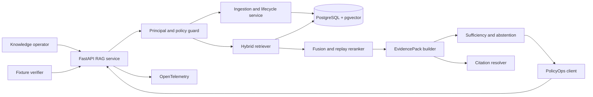
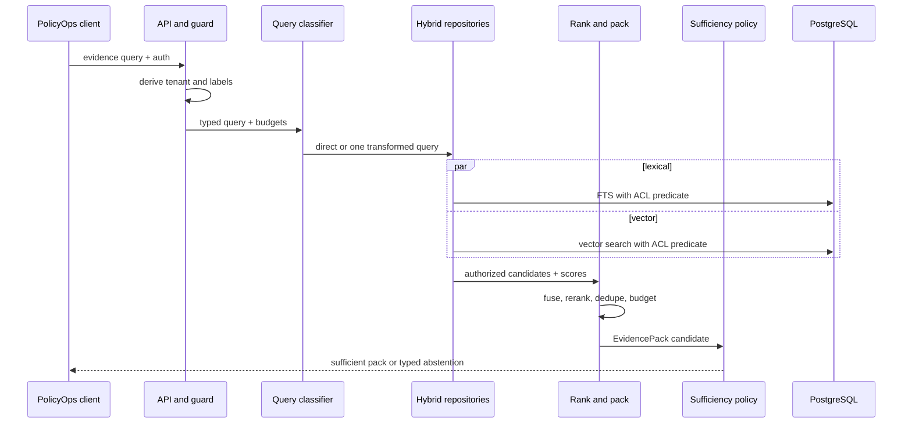

# Chapter 6 Architecture: Citation-First Hybrid RAG Service

This architecture realizes the [Chapter 6 PRD](./prd.md) and preserves a provider-neutral evidence boundary for [Chapter 7](../ch07-graph-retrieval/architecture.md).

## Architecture goals and invariants

The design favors a small transactional system over a distributed ingestion platform. PostgreSQL is the source of truth for source versions, ACLs, chunks, vectors, jobs, and active-index manifests. The invariants are: authorization precedes ranking; only one source version is active; every passage resolves to immutable source content; retrieval never fabricates an answer; and the fixture profile is deterministic without network credentials.



## Components and responsibilities

| Component | Responsibility |
|---|---|
| API layer | Validate versioned requests, authenticate principals, map typed errors, and propagate correlation IDs. |
| Principal guard | Resolve trusted tenant and document scope and construct mandatory repository predicates. |
| Ingestion service | Parse supplied fixtures, normalize structure, generate chunks, attach ACLs, and stage versions. |
| Lifecycle service | Activate replacements, tombstone deletions, invalidate cached packs, and issue receipts. |
| Lexical/vector repositories | Run PostgreSQL full-text and pgvector queries with identical authorization filters. |
| Query classifier | Select a typed route and allow no more than one budgeted transformation. |
| Fusion/reranker | Normalize scores, reciprocal-rank fuse, replay deterministic reranking, and record stage scores. |
| EvidencePack builder | Deduplicate parent/child spans, enforce passage/token budgets, and retain exclusions. |
| Sufficiency policy | Decide sufficient, conflicting, or insufficient from explicit evidence features. |
| Citation resolver | Resolve authorized immutable version/span references and coordinates. |
| Verifier | Load gold fixtures, inject faults, compute metrics, and emit JSON, JUnit, and trace evidence. |
| Stage bulkheads | Reserve independent bounded capacity for lexical, vector, rerank, and OCR/table work; propagate deadline, cancellation, and typed throttling. |

## Interfaces and contracts

```python
class RetrievalAuthorization(BaseModel):
    run_context_hash: str
    request_id: UUID
    trace_id: str
    actor_id: str
    tenant_id: str
    scopes: frozenset[str]
    allowed_labels: set[str]
    data_classification: str
    configuration_id: str

class Citation(BaseModel):
    source_id: UUID
    version_id: UUID
    span_id: UUID
    content_hash: str
    section_path: list[str]
    page: int | None = None
    region: tuple[float, float, float, float] | None = None

class EvidenceItem(BaseModel):
    citation: Citation
    text: str
    lexical_score: float | None
    vector_score: float | None
    rerank_score: float | None
    excluded_reason: str | None = None

class EvidenceBudget(BaseModel):
    max_passages: int
    max_tokens: int

class EvidencePack(BaseModel):
    schema_version: Literal["1.0"]
    query_id: UUID
    items: list[EvidenceItem]
    budget: EvidenceBudget
    sufficiency: Literal["sufficient", "conflicting", "insufficient"]
    reason_codes: list[str]
```

`RetrievalAuthorization` is a server-local derived view, not a portable identity token. `RetrievalAuthorization.from_run_context(run_context)` is the only supported construction path, records the canonical context hash, and is contract-tested against Chapter 1; no caller-supplied or unscoped overload exists. Before a process, network, worker, or protocol trust boundary, the receiver must rehydrate and reauthorize the full `RunContext` by hash rather than trust this reduced view. `Retriever.search(query, authorization, limits) -> CandidateSet` is implemented by lexical and vector adapters.

Embedding and reranking use distinct ports rather than overloading the Chapter 1 generation contract: `EmbeddingClient.embed(texts, context) -> EmbeddingBatch` and `Reranker.rank(query, candidates, context) -> RankedCandidates`. Answer generation, when enabled, retains `ModelClient.generate(request, context)`. The required profile binds `FixtureEmbeddingClient`, `ReplayReranker`, and the shared `RunContext`.

`EvidenceContextSource` implements the frozen Chapter 5 `ContextSource.summaries()` and `materialize()` contract. It advertises authorized evidence summaries cheaply, materializes only selected `EvidenceItem` IDs, and preserves tenant, authority, trust, provenance, sensitivity, freshness, required/optional, stable/variable, and token-estimate fields. Contract tests run this adapter through the Chapter 5 planner so retrieval cannot bypass context budgets or authority checks.

Ingestion requests carry `source_id`, expected version, parser type, content hash, ACL labels, effective dates, and idempotency key. The API returns `202` with a job ID, `409` for version conflicts, and the same prior result for replayed keys.

## Data and storage

Core tables are `sources`, `source_versions`, `source_acl`, `sections`, `spans`, `page_regions`, `chunks`, `chunk_embeddings`, `ingestion_jobs`, `index_manifests`, and `lifecycle_receipts`. Source content is normalized once and hashed. Spans use normalized character offsets; page regions retain OCR coordinates. Chunks reference parent spans rather than copying provenance fields.

An ingestion transaction writes a staged version and all descendants. A short activation transaction changes the source's active version and manifest generation. Queries pin a manifest generation for their duration. Deletion marks the source unavailable, removes descendant search rows, and creates a content-free receipt. PostgreSQL advisory locks serialize lifecycle operations by source ID. Redis is deliberately omitted; a bounded in-process worker claims durable jobs with `FOR UPDATE SKIP LOCKED`.

## Query runtime



The classifier cannot recursively call itself. A monotonic budget records transformations, candidate counts, reranker calls, elapsed time, and packed tokens. Exhaustion becomes `EVIDENCE_INSUFFICIENT` or `RETRIEVAL_TIMEOUT`.

Each retrieval stage owns a small semaphore and deadline slice rather than sharing one unbounded executor. Lexical and vector branches may run concurrently only after both reservations succeed; reranking and OCR/table materialization have separate limits. Downstream throttling honors bounded retry guidance only when the original deadline and query budget allow it. A saturated branch is cancelled or marked unavailable, and partial evidence may continue only when the existing sufficiency policy passes. Fleet-wide admission, tenant-fair queues, service-entry `429` responses, and provider quota operations belong to Chapter 14.

## Security and trust boundaries

The API/auth boundary is the only place bearer credentials are accepted. Trusted tenant scope comes from verified claims, not request JSON. Database roles separate migrations, ingestion, and serving; serving cannot activate or delete versions. Row predicates are built from typed values and applied to FTS and vector statements. Retrieved content, filenames, metadata, and extension-like instructions remain untrusted data, are delimited in any downstream context, and cannot modify budgets or tools.

Traces contain IDs, hashes, classifications, counts, and scores but not bodies, vectors, or credentials. Optional model providers receive only authorized packed passages. Fixture poison strings verify that content cannot alter system behavior.

## Failure, recovery, and idempotency

- Ingestion jobs persist states `queued`, `parsing`, `indexing`, `staged`, `active`, or `failed`; workers resume from the last completed stage.
- Content hash plus source ID and idempotency key prevents duplicate versions. A changed payload under a reused key returns `409`.
- Activation is atomic; a failed build leaves the old manifest active. Startup reconciliation marks abandoned leases for retry.
- Query timeouts cancel database work and return a typed abstention. Partial lexical/vector success is allowed only when a declared sufficiency rule passes and the degraded route is visible.
- Deletion is idempotent. Cache entries, if added later, must key on tenant and manifest generation and be invalidated by lifecycle events.

## Observability and evaluation

OpenTelemetry spans cover `authorize`, `classify`, `lexical_search`, `vector_search`, `fusion`, `rerank`, `pack`, `sufficiency`, and lifecycle stages. Metrics include candidates and exclusions per stage, recall/nDCG, citation resolution, abstention outcomes, ACL denials, manifest generation, freshness lag, and p50/p95 latency. Logs use reason codes and correlation IDs.

The verifier separates retrieval judgments from answer judgments, records fixture/dependency/configuration/hardware hashes, and produces `scorecard.json`, `junit.xml`, traces, and lifecycle receipts under `build/ch06`. It runs poison, tenant, supersession, deletion, and timeout drills.

## Deployment and local development

Docker Compose runs the FastAPI service and a pinned non-root PostgreSQL/pgvector container. The same application image can run `api`, `worker`, or `verify` commands as a non-root user with a read-only root filesystem and writable evidence volume. Health checks distinguish process health, database readiness, migrations, and active-manifest readiness. Secrets are injected at runtime; the fixture profile has none. Exact versions are locked with `uv.lock` and image digests at implementation kickoff.

## Testing strategy

- Unit tests cover parsing, chunk boundaries, score normalization, fusion, packing, sufficiency, and typed errors.
- Property tests assert that every returned span is allowed, resolvable, within budget, and from an active version.
- Contract tests run every retriever and optional `ModelClient` against shared schemas.
- Integration tests exercise migrations, transactions, FTS/vector filters, lifecycle races, OCR/table lineage, and citation resolution.
- Fault tests inject poison, cross-tenant access, supersession, deletion, and repository timeouts.
- Bulkhead tests saturate lexical, vector, rerank, and OCR/table stages independently and assert bounded concurrency, cancellation propagation, and typed degraded or abstention behavior.
- Evaluation tests compare metric gates on visible and hidden gold splits.

## Architecture decisions and trade-offs

1. **PostgreSQL is both metadata and retrieval store.** This keeps ACL and activation transactional; a specialized vector store may be added only behind the repository contract with equivalent filtering tests.
2. **Deterministic fusion before model-driven behavior.** Reciprocal-rank fusion and replay reranking make the baseline explainable and reproducible.
3. **Immutable versions with manifest swaps.** Storage cost is accepted for reliable citations, rollback, and concurrent reads.
4. **One bounded transformation, not an agent loop.** Complex retrieval is deferred until orchestration and loop budgets exist.
5. **No Redis in the core lab.** PostgreSQL leases are enough for the scoped workload and reduce operating surface.

## Implementation sequence

1. Land contracts, schema migrations, fixture hashes, and citation resolver.
2. Implement idempotent ingestion, staging, activation, and deletion receipts.
3. Add authorization-scoped lexical/vector repositories and deterministic fusion/reranking.
4. Build EvidencePack budgeting, sufficiency, abstention, and scanned/table support.
5. Instrument traces and metrics; implement verifier, fault drills, and CI gate.
6. Register the index, retrieval, authorization, freshness, and citation evidence for the capstone.

## PRD requirement mapping

| Architecture area | PRD requirements |
|---|---|
| Ingestion, versions, manifests, versioned contracts | CH06-FR-001, CH06-FR-002, CH06-NFR-002, CH06-NFR-004 |
| Scoped repositories and guard | CH06-FR-003, CH06-FR-004, CH06-SEC-001, CH06-SEC-003 |
| Fusion, pack, citation | CH06-FR-005, CH06-FR-006, CH06-FR-009 |
| Classifier and sufficiency | CH06-FR-007, CH06-FR-008 |
| Verifier, stage bulkheads, and telemetry | CH06-FR-010, CH06-FR-011, CH06-NFR-001, CH06-NFR-003, CH06-NFR-005 |
| Lifecycle security | CH06-SEC-002, CH06-SEC-004, CH06-SEC-005 |
