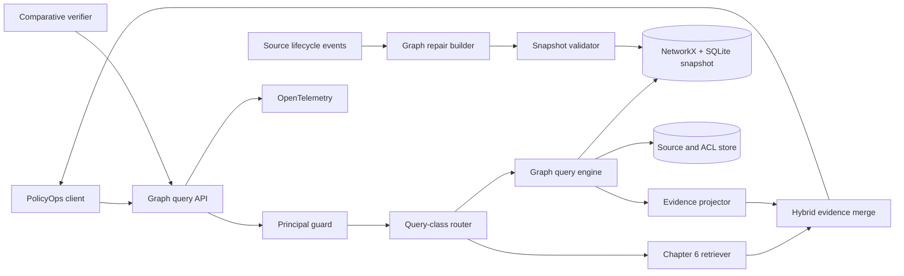
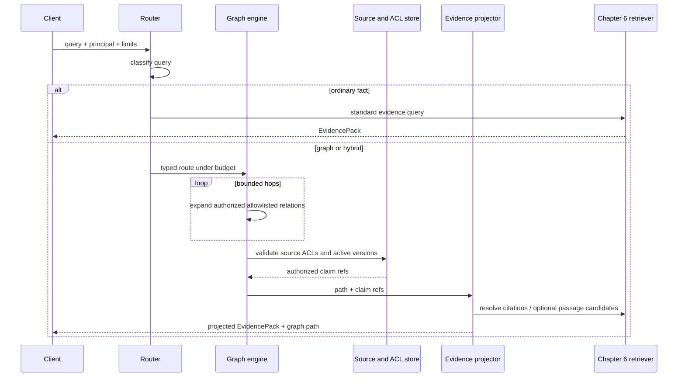

# Chapter 7 Architecture: Graph Retrieval for Multi-Hop Questions

This architecture implements the [Chapter 7 PRD](./prd.md). It adds an optional, source-linked graph route while keeping the [Chapter 6 retriever](../ch06-citation-first-hybrid-rag/architecture.md) canonical for ordinary questions.

## Architecture goals and invariants

The graph is a derived index, never a source of record. Every claim, edge, summary, and answer path must resolve to immutable source evidence. All traversals are tenant-scoped and bounded. Snapshot publication is atomic. The router must be able to choose `standard_rag`, and the evaluation may legitimately conclude that no graph is justified.



## Components and responsibilities

| Component | Responsibility |
|---|---|
| Graph API | Validate versioned requests, enforce route budgets, and return typed paths and evidence. |
| Principal guard | Resolve tenant and labels and create mandatory graph/source predicates. |
| Query classifier/router | Select `standard_rag`, `local_graph`, `multi_hop_graph`, `temporal_graph`, `global_graph`, or `hybrid_graph_vector` from typed features; keep `drift_graph` optional and ADR-gated. |
| Snapshot loader | Verify manifest and hashes and materialize the persisted NetworkX/SQLite adapter. |
| Entity resolver | Map aliases to canonical IDs while representing ambiguity and merge lineage. |
| Graph query engine | Execute allowlisted, bounded traversals and community lookups against a pinned snapshot. |
| Temporal/contradiction policy | Evaluate effective intervals and retain competing source claims. |
| Evidence projector | Resolve graph claims to Chapter 6 citations and produce `EvidencePack` items and path explanations. |
| Repair builder | Apply source lifecycle events to a copy-on-write affected subgraph. |
| Snapshot validator/registry | Check schema, lineage, ACL consistency, and hashes before atomic activation or rollback. |
| Comparative verifier | Evaluate routes by class and produce graph-versus-RAG ADR inputs. |

## Interfaces and contracts

```python
class GraphQuery(BaseModel):
    query: str
    authorization: RetrievalAuthorization
    as_of: datetime | None
    max_hops: int = Field(default=3, ge=1, le=4)
    max_fanout: int = Field(default=25, ge=1, le=100)

class ClaimRef(BaseModel):
    claim_id: str
    subject_entity_id: str
    predicate: str
    object_entity_id: str | None = None
    value: str | None = None
    source_id: str
    source_version: str
    span_id: str
    extraction_version: str
    confidence: float
    tenant_id: str
    valid_from: date | None = None
    valid_to: date | None = None
    status: Literal["supported", "suspected", "refuted", "superseded"]

class GraphPath(BaseModel):
    snapshot_id: str
    entity_ids: list[str]
    relation_ids: list[str]
    claim_refs: list[ClaimRef]
    status: Literal["supported", "conflicting", "partial"]
```

`RetrievalAuthorization` is imported from Chapter 6 and can be constructed only from the canonical Chapter 1 `RunContext`. `GraphAdapter.neighbors(entity_id, authorization, relation_types, snapshot_id)` requires it on every call. `EvidenceProjector.project(path, authorization) -> EvidencePack` resolves each `claim_refs` entry through the Chapter 6 citation repository. String identifiers carry the canonical serialized source/claim IDs and are validated at the adapter boundary. `SnapshotRegistry.activate(candidate_id, expected_active_id)` provides compare-and-swap semantics. Router implementations conform to `route(QueryFeatures) -> RouteDecision` and emit scores/reasons for evaluation.

## Data and storage

The snapshot manifest records schema version, source-manifest generation, extraction version, tenant partitions, node/edge files, community summaries, and hashes. SQLite stores typed node, alias, edge, claim, source-link, and community-member tables plus indexes for tenant, entity, effective interval, and source version. NetworkX loads only the selected tenant partition for traversal; source bodies remain in Chapter 6 storage.

Derived summaries contain claim ID sets and hashes, never provenance-free prose. Active-snapshot metadata lives in a small PostgreSQL registry so publication can coordinate with the active source manifest. Repair creates a candidate snapshot by copying unaffected partitions and rebuilding only records reachable from the changed source links.

## Query runtime



Traversal stops on hop, fan-out, candidate, or time budget. A partial path is never labeled sufficient unless its projected evidence independently passes Chapter 6 sufficiency checks.

## Security and trust boundaries

Snapshot construction is a privileged offline operation; the serving process receives read-only snapshots and cannot rewrite them. The loader verifies signed or locally trusted manifests and content hashes. Tenant partition is selected before graph load, and every seed, expansion, claim, and source citation is checked. Counts and summaries are redacted when they would reveal forbidden topology.

Graph labels, extracted claims, and summaries are untrusted evidence. They cannot grant permissions, write memory, invoke tools, or alter routing budgets. API traces use opaque IDs and claim counts, not source text or unauthorized neighbor IDs.

## Failure, recovery, and idempotency

- Queries pin the active snapshot ID so a concurrent publication cannot mix versions.
- Invalid/missing lineage, schema mismatch, source-generation mismatch, or hash failure rejects a candidate before activation.
- Activation uses compare-and-swap; failure leaves the prior snapshot active. Rollback repoints the registry to the prior verified snapshot.
- Repair event ID plus source version is the idempotency key. Duplicate events return the earlier receipt.
- Traversal timeout returns a typed `partial` or abstention; it does not fall back to uncited graph text.
- If the graph adapter is unavailable, the router may use Chapter 6 only when policy allows and records a degraded-route trace.

## Observability and evaluation

Spans cover `classify`, `resolve_entities`, `traverse`, `temporal_filter`, `authorize_claims`, `project_evidence`, `repair`, `validate_snapshot`, and `activate_snapshot`. Metrics include route selection, hop/fan-out distributions, path yield, lineage failures, contradictions, tenant denials, snapshot age, repair scope, activation duration, and latency by route.

The comparative verifier executes identical query IDs through Chapter 6, graph, and hybrid routes. It reports task success, evidence recall, path precision, route confusion, graph index size/time, query latency, tokens, and cost estimates by class. The ADR generator consumes the report but never auto-approves graph adoption.

## Deployment and local development

Docker Compose runs FastAPI, PostgreSQL for source/registry data, and a non-root application container with a read-only mounted snapshot. SQLite and NetworkX avoid an external graph service. Candidate snapshots are written to a separate build volume, validated, then made available by immutable ID. The fixture profile uses supplied data and replay behavior. Optional extraction binds a provider-neutral `ModelClient`; credentials are runtime-only. Versions are locked at implementation kickoff.

## Testing strategy

- Unit tests cover alias ambiguity, temporal intervals, contradiction policy, route features, traversal budgets, and evidence projection.
- Property tests assert every served path is bounded, tenant-consistent, and composed entirely of resolvable active claims.
- Contract tests validate snapshot manifests and Chapter 6 `EvidencePack` compatibility.
- Integration tests run local, multi-hop, corpus, temporal, and hybrid queries through SQLite/NetworkX and PostgreSQL ACL checks.
- Repair tests compare snapshot hashes, proving changed records update and unrelated regions remain identical.
- Fault tests cover cross-tenant adjacency, malformed/tampered snapshots, missing source spans, timeouts, correction, supersession, deletion, activation collision, and rollback.

## Architecture decisions and trade-offs

1. **Derived graph beside RAG, not above it.** Ordinary questions avoid graph cost and a clean no-graph decision remains possible.
2. **Supplied extraction snapshot for the core.** This isolates retrieval engineering from variable extraction quality while preserving an optional extraction experiment.
3. **NetworkX/SQLite adapter.** It is reproducible and sufficient for lab scale; production graph stores must pass the same port and isolation suite.
4. **Claim-level lineage, not summary-only citations.** Extra storage and projection work buy correct repair and evidence accountability.
5. **Copy-on-write snapshot repair.** Temporary storage cost is accepted for atomic activation, validation, and rollback.

## Implementation sequence

1. Implement schema, snapshot manifest, loader, adapter, and lineage validation.
2. Add entity resolution, bounded routes, temporal/contradiction logic, and tenant predicates.
3. Project paths through Chapter 6 citation/evidence contracts and implement hybrid merge.
4. Build repair, candidate validation, compare-and-swap activation, receipts, and rollback.
5. Add telemetry, comparative evaluation, fault drills, ADR, and capstone registration.

## PRD requirement mapping

| Architecture area | PRD requirements |
|---|---|
| Snapshot, schema, lineage | CH07-FR-001, CH07-FR-002, CH07-SEC-003 |
| Entity resolution and routes | CH07-FR-003, CH07-FR-004, CH07-FR-005 |
| Temporal evidence projection | CH07-FR-006, CH07-FR-007, CH07-SEC-005 |
| Repair and registry | CH07-FR-008, CH07-NFR-004, CH07-SEC-004 |
| Principal guard | CH07-FR-009, CH07-SEC-001, CH07-SEC-002 |
| Verifier and telemetry | CH07-FR-010, CH07-NFR-001, CH07-NFR-002, CH07-NFR-003, CH07-NFR-005 |
