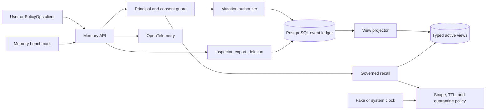
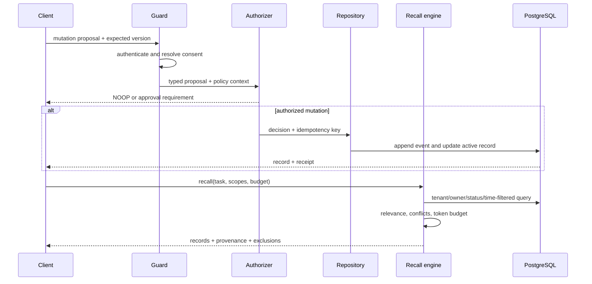

# Chapter 8 Architecture: Governed Long-Term Memory

This architecture implements the [Chapter 8 PRD](./prd.md). It keeps persistent memory separate from source evidence and supplies controlled recall to [Chapter 9 extensions](../ch09-secure-extension-pack/architecture.md).

## Architecture goals and invariants

One append-only mutation ledger drives typed materialized views; four memory categories do not require four databases. Every active record has owner, tenant, scope, purpose, provenance, consent, confidence, sensitivity, effective time, expiry, verification state, and optimistic version. Recall is read-only and cannot grant authority. Deletion and expiry cover derived views. The required path is deterministic and credential-free.



## Components and responsibilities

| Component | Responsibility |
|---|---|
| Memory API | Validate requests, authenticate principal, enforce idempotency and expected versions, and return typed errors. |
| Consent guard | Resolve purpose-bound consent and prevent unapproved sensitive writes or scope widening. |
| Mutation authorizer | Produce `ADD`, `UPDATE`, `DELETE`, or `NOOP` and stable reasons before persistence. |
| Event ledger/repository | Append immutable mutation events and atomically update active records and receipts. |
| View projector | Materialize working, episodic, semantic, and procedural views from record type and lifecycle state. |
| Recall engine | Retrieve authorized candidates, apply time/scope/status filters, rank relevance, and enforce budgets. |
| Conflict resolver | Link competing memories and select a supported view using authority, correction, confidence, and time. |
| Consolidator | Create source-linked summaries from repeated episodes under explicit policy. |
| Quarantine policy | Detect benchmark poisoning indicators and isolate suspicious proposals and records. |
| Inspector/export/deletion service | Provide user control and verifiable lifecycle receipts. |
| Benchmark/verifier | Compare no-memory and governed-memory outcomes and run privacy/fault scenarios. |

## Interfaces and contracts

```python
class MemoryRecord(BaseModel):
    id: UUID
    kind: Literal["working", "episodic", "semantic", "procedural"]
    tenant_id: str
    owner_id: str
    scope: Literal["personal", "team", "tenant", "global"]
    content: dict[str, Any]
    provenance: list[SourceRef]
    consent_id: UUID | None
    sensitivity: str
    confidence: float
    valid_from: datetime
    expires_at: datetime | None
    status: Literal["active", "conflicting", "quarantined", "expired", "deleted"]
    version: int

class MutationDecision(BaseModel):
    action: Literal["ADD", "UPDATE", "DELETE", "NOOP"]
    target_id: UUID | None
    expected_version: int | None
    reason_codes: list[str]
    required_approval: ApprovalRef | None
```

`MemoryAuthorizer.evaluate(proposal, principal, consent, clock) -> MutationDecision` is pure and fixture-testable. `MemoryRepository.apply(decision, idempotency_key)` persists only authorized decisions. `MemoryRetriever.recall(task, principal, scope_allowlist, as_of, budget) -> RecallResult` returns records plus exclusion counts/reasons. No interface accepts tool permissions or approval tokens from memory content.

`MemoryContextSource` implements the frozen Chapter 5 `ContextSource.summaries()` and `materialize()` contract over `MemoryRetriever`. Its summaries and items retain tenant, owner/scope, untrusted-memory trust class, provenance, sensitivity, verification status, expiry/freshness, required/optional, stable/variable placement, and token estimate. The adapter cannot emit policy authority, capability scope, or approval fields. Chapter 5 contract tests run against consented, expired, quarantined, corrected, deleted, and cross-tenant records.

## Data and storage

PostgreSQL tables include `memory_events`, `memory_records`, `memory_provenance`, `memory_conflicts`, `memory_consolidation_members`, `consent_receipts`, `memory_idempotency`, `export_jobs`, and `deletion_receipts`. Row-level indexes cover tenant, owner, kind, scope, status, validity, and expiry. Content is stored as validated JSON by record kind; sensitive subfields can be application-encrypted when the deployment requires it.

The ledger event and active-record update occur in one transaction. Projected “views” are SQL views or indexed queries over `memory_records`, avoiding synchronization among stores. Consolidations reference all member versions. Deletion plans first enumerate records, conflict links, consolidation descendants, search indexes, and caches, then remove content atomically and write a content-free receipt.

## Mutation and recall runtime



The server injects the clock. The fixture binds a controllable fake clock; production binds a UTC system clock. Recall filters expired and quarantined rows in the repository query, then applies conflict and relevance policies. Returned content is labeled untrusted before entering any model context.

## Security and trust boundaries

Authentication and consent resolution sit before authorizer/repository calls. Principal, tenant, and allowed administrative capabilities are not request-overridable. Scope widening is its own mutation with a bound approval. Quarantine storage uses a repository method unavailable to normal recall. Export links are short-lived and recipient-bound.

Memory text is a hostile-input boundary. It is structurally separated from system instructions and cannot populate tool names, scopes, approval IDs, or delegation fields. Observability records IDs, kinds, reason codes, hashes, and counts, never content or consent artifacts. Database roles separate serving, privacy administration, and migrations.

## Failure, recovery, and idempotency

- Mutation idempotency keys map to request hashes and prior results; reuse with changed input returns `409`.
- Expected-version predicates make updates/deletes compare-and-swap operations. A stale write makes no event or view change.
- Projector work is transactional in the core design; optional asynchronous indexes rebuild from the ledger and checkpoint event IDs.
- Consolidation is idempotent by policy version and sorted member-version hash.
- Expiry is enforced at read time even if background cleanup is delayed. Cleanup uses leases and can safely retry.
- Deletion persists a plan ID, executes within a transaction where feasible, and verifies all derived locations before issuing a receipt.
- If semantic ranking fails, recall may use deterministic structured ranking and records degradation; it never widens scope.

## Observability and evaluation

OpenTelemetry spans cover `resolve_consent`, `authorize_mutation`, `append_event`, `project_view`, `recall_filter`, `rank`, `resolve_conflict`, `consolidate`, `export`, and `delete`. Metrics include decisions by reason, conflicts, stale writes, consent denials, active/expired/quarantined counts, recall precision, TTL lag, deletion completeness, tenant-denial attempts, and latency.

The benchmark replays labeled sessions with a fake clock and compares no-memory to governed-memory outcomes. Evidence includes JSON metrics, JUnit, redacted traces, lifecycle receipts, and configuration/fixture hashes. Privacy tests have hard zero-tolerance gates.

## Deployment and local development

Docker Compose runs the non-root FastAPI service and pinned PostgreSQL. The API and maintenance commands share one image but use separate database roles. `policyops memory seed|verify|benchmark` is a thin CLI over the same application ports used by the API and fixture verifier; it owns no separate policy or persistence behavior. Background expiry/consolidation may run as a short-lived scheduled command; no always-on queue or Redis is required. The fixture profile uses deterministic ranking. Optional vector or hosted-model adapters are configured at runtime, with secrets outside repository and model-visible context. Exact versions are locked at kickoff.

## Testing strategy

- Unit tests cover authorizer decisions, consent/purpose matching, effective dates, TTL, conflict policy, consolidation, and reason codes.
- State-machine/property tests generate mutation sequences and assert ledger consistency, version monotonicity, and no recall after deletion/expiry.
- Contract tests run deterministic and optional semantic retrievers against the same typed port.
- Integration tests cover transactions, concurrent updates, view queries, fake-clock cleanup, export, and deletion receipts.
- Security tests attempt cross-tenant/subject access, scope widening, poison recall, consent replay, and authority injection.
- Benchmark tests measure task benefit and regression against the no-memory baseline.

## Architecture decisions and trade-offs

1. **One ledger, multiple typed views.** This reduces synchronization failures; specialized stores remain optional projections.
2. **Pure authorizer before persistence.** It makes consent and lifecycle decisions reproducible, testable, and explainable.
3. **Read-time expiry plus cleanup.** Correctness does not depend on scheduler timing, at the cost of an extra predicate.
4. **Structured deterministic retrieval first.** Semantic search is optional because governance, not embedding novelty, is the learning objective.
5. **Memory never carries authority.** Some conveniences are rejected to preserve a simple and enforceable trust boundary.

## Implementation sequence

1. Implement record/event schemas, migrations, clock port, consent resolver, and reason codes.
2. Add pure mutation authorizer, transactional repository, versions, and idempotency.
3. Implement scoped recall, conflicts/corrections, TTL, consolidation, and quarantine.
4. Add inspector, export, deletion planning/receipts, and optional retrieval port.
5. Instrument, benchmark, fault-test, gate CI, and register lifecycle/privacy evidence for the capstone.

## PRD requirement mapping

| Architecture area | PRD requirements |
|---|---|
| Ledger and views | CH08-FR-001, CH08-FR-003, CH08-NFR-002, CH08-NFR-005 |
| Authorizer and concurrency | CH08-FR-002, CH08-FR-004, CH08-SEC-002 |
| Recall and conflict policy | CH08-FR-005, CH08-FR-006, CH08-NFR-003, CH08-NFR-004 |
| Consolidation, scope, quarantine | CH08-FR-007, CH08-FR-008, CH08-FR-009, CH08-SEC-003, CH08-SEC-006 |
| User controls | CH08-FR-010, CH08-SEC-004, CH08-SEC-005 |
| Benchmark and guard | CH08-FR-011, CH08-NFR-001, CH08-SEC-001 |
