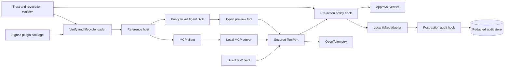
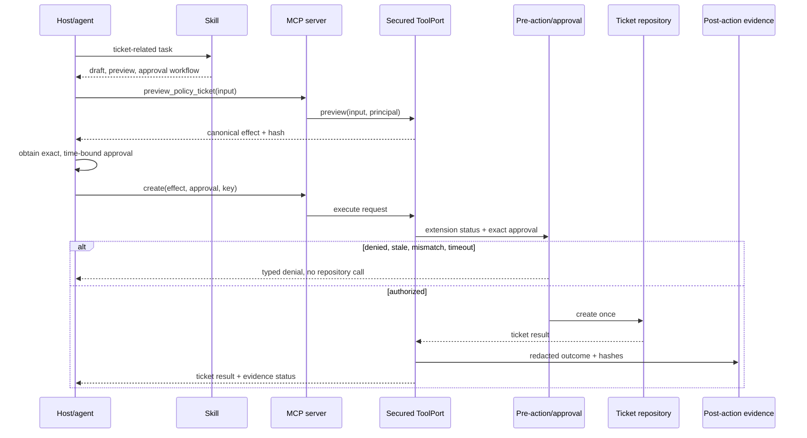

# Chapter 9 Architecture: Secure PolicyOps Extension Pack

This architecture implements the [Chapter 9 PRD](./prd.md). It exposes one bounded capability that [Chapter 10](../ch10-bounded-orchestrator-worker/architecture.md) can orchestrate without bypassing approval or extension lifecycle controls.

## Architecture goals and invariants

The typed `ToolPort` is canonical; MCP, skill, plugin, and host adapters add interoperability, guidance, packaging, and lifecycle integration without changing authorization semantics. The host is the application and policy boundary and creates clients for admitted server connections. MCP tools are model-controlled, resources application-controlled, and prompts user-controlled for selection purposes; none of those control labels grants authorization. Every mutation reaches one final policy boundary. A skill teaches but cannot enforce or grant capability. Hooks are deterministic, bounded, and non-recursive. Packages are verified before execution and can be disabled, rolled back, or revoked. The fixture path is local and credential-free.



## Components and responsibilities

| Component | Responsibility |
|---|---|
| Tool contracts | Define preview/create schemas, impact class, typed errors, timeout, and idempotency semantics. |
| Ticket adapter | Implement one local read/write boundary and authoritative idempotency record. |
| Secured `ToolPort` decorator | Canonicalize effects and force every mutation through extension status, approval, and hooks. |
| MCP server/adapters | Publish the same capability over stdio and local HTTPS using pinned stable protocol fixtures. |
| Agent Skill | Supply narrow activation metadata and progressively disclosed workflow instructions/assets. |
| Pre-action hook | Deterministically validate identity, exact approval, extension status, and request constraints; deny on error/timeout. |
| Post-action hook | Append redacted success/failure evidence with correlation and effect hashes. |
| Plugin packager | Build a deterministic archive and manifest with content hashes, permissions, provenance, compatibility, and rollback data. |
| Loader/trust registry | Verify signatures/hashes, stage versions, enforce permissions and compatibility, and manage enable/rollback/revocation. |
| Development issuer/test CA | Mint local short-lived approval fixtures and secure the local HTTPS channel; never used as production identity. |
| Verifier | Run contract, activation, tamper, alternate-path, timeout, update, and revocation scenarios. |

## Interfaces and contracts

```python
class TicketEffect(BaseModel):
    tenant_id: str
    title: constr(min_length=5, max_length=160)
    description: constr(max_length=4000)
    severity: Literal["low", "medium", "high"]
    source_refs: list[str]

class EffectPreview(BaseModel):
    schema_version: Literal["1.0"]
    canonical_effect: TicketEffect
    effect_hash: str
    impact: Literal["write"] = "write"

class ApprovalClaims(BaseModel):
    actor_id: str
    tenant_id: str
    audience: Literal["policyops-ticket"]
    operation: Literal["create_policy_ticket"]
    effect_hash: str
    scopes: set[str]
    expires_at: datetime
    nonce: str

class ExtensionRegistry(Protocol):
    async def resolve_active(self, extension_id: str, context: RunContext) -> ExtensionVersion: ...

class RevocationStore(Protocol):
    async def status(self, target: RevocableRef, context: RunContext) -> RevocationStatus: ...

class ApprovalRecordStore(Protocol):
    async def verify_and_consume(
        self, approval: ApprovalClaims, preview: EffectPreview, context: RunContext
    ) -> ApprovalDecision: ...
```

`ToolPort.preview_policy_ticket(input, context: RunContext) -> EffectPreview` has no side effect; `context` is the canonical Chapter 1 envelope, not a second identity schema. `ToolPort.create_policy_ticket(preview, approval, idempotency_key, context: RunContext) -> TicketResult` re-canonicalizes the input and, at the final effect boundary, compares current actor, tenant, purpose, scopes, configuration, approval, and revocation state before validating the hash. The repository stores `(tenant_id, operation, idempotency_key, request_hash, result)` atomically.

`CapabilityContextSource` implements the frozen Chapter 5 `ContextSource.summaries()` and `materialize()` contract for allowlisted capability schemas and safe help. It exposes impact, input schema, availability, version, provenance, sensitivity, and token estimates, but never secrets, approval tokens, runtime grants, or mutation results. Tool invocation remains exclusively behind `ToolPort`; context materialization cannot execute a capability.

The MCP tool schema mirrors the Pydantic-generated JSON Schema. Domain errors such as `APPROVAL_REQUIRED`, `APPROVAL_STALE`, `EFFECT_MISMATCH`, `EXTENSION_REVOKED`, and `HOOK_TIMEOUT` are mapped to protocol-safe error data. Skill files never contain tokens or privileged commands.

The plugin manifest includes ID, version, build/source provenance, minimum/maximum host contract, MCP protocol profile, entry points, file hashes, requested filesystem/network/process permissions, skill/hook IDs, signing key ID, and rollback-compatible predecessor.

The required compatibility profile is MCP stable `2025-11-25`. The announced breaking `2026-07-28` release candidate is a separate opt-in profile, never an automatic upgrade. The compatibility layer version-gates transport and session behavior, Tasks and Apps extensions, sampling and logging, schemas, and authorization. Workflow progress, approvals, idempotency records, subscriptions, and resumable results live in explicit application stores even when a transport is stateless or sessionless.

## Runtime sequence



## Data and storage

The local ticket stub and audit/idempotency repository use SQLite for durable fixture behavior. SQLite is the Chapter 9 fixture binding for the canonical `ExtensionRegistry`, `RevocationStore`, and `ApprovalRecordStore` ports, not a separate application-level authority. Tables are `tickets`, `idempotency_results`, `audit_events`, `installed_extensions`, `extension_versions`, `trust_keys`, `revocations`, and `approval_nonces`. Later chapters may bind the same ports to PostgreSQL for concurrency and operations, but cannot introduce a second source of truth or change their contract semantics. Package archives and unpacked stages live in separate directories; only a verified immutable version may become active. Audit events store principal/tenant IDs, extension/tool version, effect and result hashes, decision/reason, timestamps, trace ID, and redaction status—not descriptions or tokens.

The Agent Skill contains a small activation file plus references/scripts loaded only when needed. The plugin archive contains those assets, host configuration, MCP launch configuration, hooks, schemas, manifest, and signature. Ephemeral keys and issued tokens live outside the package and are destroyed during cleanup.

## Security and trust boundaries

There are distinct install-time and run-time boundaries. At install time, the loader canonicalizes the manifest, verifies the package signature and every file hash, evaluates provenance/compatibility/permissions, and unpacks into a non-executable staging directory. It never runs validation code from an unverified package. Activation changes an immutable pointer only after checks pass.

At runtime, the MCP process and tool adapter run non-root with a minimal environment, explicit working directory, read-only package files, restricted writable data directory, and deny-by-default egress. Stdio launch uses an allowlisted absolute executable and arguments. HTTPS authenticates server certificate and token audience. Secrets are injected only into the component that needs them and are not returned to the model.

All metadata, skills, resources, and tool results are untrusted. The pre-action policy uses typed server-owned fields, not natural-language instructions. It checks active/revoked status on every mutation so emergency revocation affects already-running hosts. Hook failure is fail-closed before mutation and visible after mutation.

## Failure, recovery, and idempotency

- Duplicate execution returns the original result when request hash matches; a changed request under the same key fails `409`.
- Approval nonce is consumed atomically with ticket creation; replay cannot create a second effect.
- MCP transport failure is retryable only with the same idempotency key. Unknown outcomes are resolved through a status/read operation.
- Pre-hook timeout or exception denies before repository access. Post-hook failure places a bounded redacted event in a local outbox and marks `evidence_status=degraded`; it never repeats the ticket mutation.
- Invalid staged updates leave the active pointer untouched. Activation records the predecessor; rollback atomically restores a verified version.
- Revocation prevents activation and new mutation calls. Disablement can be host-local; revocation is trust-registry authoritative.

## Observability and evaluation

OpenTelemetry spans cover host invocation, MCP negotiation/call, tool validation, canonicalization, pre-hook, approval verification, repository write, post-hook, package verification, activation, rollback, and revocation checks. Attributes are allowlisted and redacted. Metrics include activations, calls by impact, denials/reasons, duplicate deliveries, hook duration/timeouts, audit-outbox depth, package failures, active versions, and revocation-check age.

The verifier drives direct and MCP calls through the same contract suite, evaluates skill activation on positive/negative tasks, and runs missing/stale/mismatched approvals, malicious metadata, tampering, invalid update, duplicate, hook timeout, bypass attempts, disablement, rollback, and revocation. Evidence includes package manifest/signature reports, threat model, JSON/JUnit, and redacted traces.

## Deployment and local development

Docker Compose runs the ticket stub, local HTTPS MCP service, development issuer, and verifier; stdio mode can run directly through the same image. Containers use non-root users, read-only roots, explicit volumes, and a private network. The test CA and ephemeral signing material are generated per run outside source control and removed during cleanup. The required replay profile needs no model. The lockfile and manifest pin the stable `2025-11-25` MCP SDK/protocol profile; the `2026-07-28` release-candidate fixture is isolated behind an explicit compatibility flag and may not change the required stable gate.

## Testing strategy

- Unit tests cover schema/semantic validation, canonical hashes, approval claims, reason codes, idempotency, manifest canonicalization, and hook bounds.
- Contract tests run direct, stdio MCP, and HTTPS MCP adapters against identical fixtures.
- Compatibility tests prove the stable profile, reject unsupported feature negotiation, keep the release-candidate profile opt-in, and preserve explicit application state across transport/session replacement.
- Skill tests measure activation precision/recall and validate progressive references and negative examples.
- Integration tests cover preview/approval/create, outbox delivery, install/stage/activate/rollback, and live revocation.
- Security tests inject metadata/results, inspect redaction, try path traversal, excessive permissions, token/audience confusion, unsigned/tampered packages, and alternate-path bypass.
- Fault tests kill transports, time out hooks, duplicate requests, corrupt updates, and revoke during a running host session.

## Architecture decisions and trade-offs

1. **Typed tool first.** MCP is an adapter, preventing protocol or host packaging from becoming business logic.
2. **Skill for knowledge, hook for enforcement.** Natural-language guidance remains flexible; authorization remains deterministic.
3. **One-host plugin core.** A complete, tested package is more useful than shallow portability claims; the second host is documented only.
4. **Signature plus per-file hashes.** This adds packaging work but detects archive and post-unpack tampering.
5. **Fail-closed pre-hook, outboxed post-hook.** Authorization integrity takes precedence, while completed effects remain idempotent if evidence delivery degrades.
6. **SQLite fixture store.** It is sufficient for reproducible semantics; capstone deployments may bind a production repository behind the same ports.

## Implementation sequence

1. Land schemas, ticket adapter, idempotency repository, preview/effect hashing, and direct contract tests.
2. Add approval verifier and one secured `ToolPort`; prove all paths converge there.
3. Implement stdio/HTTPS MCP adapters, skill, activation tests, pre/post hooks, and outbox.
4. Build deterministic package/manifest/signature, loader, trust registry, lifecycle operations, and reference-host adapter.
5. Add sandboxing, telemetry, threat model, portability notes, all fault drills, CI gate, and capstone evidence.

## PRD requirement mapping

| Architecture area | PRD requirements |
|---|---|
| Tool, preview, approval | CH09-FR-001, CH09-FR-002, CH09-SEC-004 |
| MCP and skill | CH09-FR-003, CH09-FR-004, CH09-NFR-002 |
| Package and loader | CH09-FR-005, CH09-FR-008, CH09-FR-009, CH09-NFR-004, CH09-SEC-005 |
| Hooks and common port | CH09-FR-006, CH09-FR-007, CH09-FR-010, CH09-SEC-006 |
| Compatibility, versioned profiles, explicit state, and fixtures | CH09-FR-011, CH09-FR-012, CH09-NFR-001, CH09-NFR-005 |
| Sandbox, secrets, telemetry | CH09-NFR-003, CH09-SEC-001, CH09-SEC-002, CH09-SEC-003, CH09-SEC-007 |
