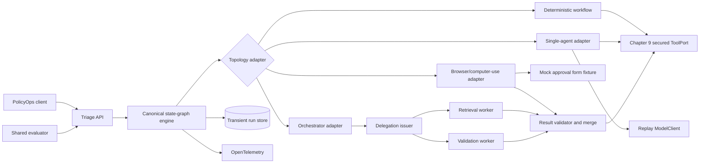
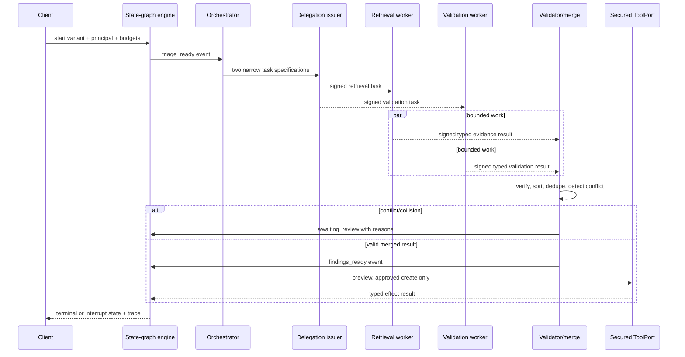

# Chapter 10 Architecture: Bounded Orchestrator-Worker Flow

This architecture implements the [Chapter 10 PRD](./prd.md). The canonical state graph is intentionally transport- and framework-neutral so [Chapter 11](../ch11-resumable-agent-loop/architecture.md) can add durable execution without redesigning control logic.

## Architecture goals and invariants

One domain graph and set of ports support deterministic, single-agent, browser/computer-use, and orchestrator-worker adapters. Known rules run deterministically. All model, browser, and worker behavior is bounded. Delegation can narrow but never expand principal authority. Worker output, DOM/screen observations, and browser action results are data until validated. Fan-in is deterministic. Final side effects remain behind Chapter 9 approval. Chapter 10 stores only a transient run snapshot; crash consistency and delivery mechanics are explicitly deferred.



## Components and responsibilities

| Component | Responsibility |
|---|---|
| Triage API | Validate run/control requests, authenticate principal, and expose state/version. |
| Canonical state graph | Own typed states, deterministic guards, transitions, joins, interrupts, and terminal outcomes. |
| Budget ledger | Atomically reserve and release run-local model, token, tool, worker, concurrency, time, spend, and retry capacity; emit typed `capacity_unavailable`. |
| Deterministic adapter | Execute the graph using explicit rules and fixed steps only. |
| Single-agent adapter | Request bounded decisions from `ModelClient` and translate them into validated graph events. |
| Browser/computer-use adapter | Read fixture DOM/screen observations, perform bounded mock-form actions, and emit action traces without bypassing the secured ToolPort. |
| Orchestrator adapter | Create independent tasks, schedule concurrency, cancel work, and feed validated results to fan-in. |
| Delegation issuer/verifier | Canonicalize and sign tasks; verify identity, ancestry, authority, expiry, nonce, and result binding. |
| Workers | Perform narrow retrieval or validation against scoped evidence and tool ports. |
| Result validator/merger | Check schemas/provenance/budgets and apply deterministic duplicate/conflict/collision policy. |
| Human-control service | Apply pause/resume/cancel events through state-version guards. |
| Optional A2A transport | Carry the same task/result envelope across a justified independent runtime. |
| Comparative evaluator | Run identical cases and generate traces, metrics, report, and ADR inputs. |

## Interfaces and contracts

```python
class PrincipalRef(BaseModel):
    run_context_hash: str
    request_id: UUID
    trace_id: str
    actor_id: str
    tenant_id: str
    roles: frozenset[str]
    scopes: frozenset[str]
    data_classification: str
    configuration_id: str

    @classmethod
    def from_run_context(cls, context: RunContext) -> "PrincipalRef": ...

class TaskState(BaseModel):
    schema_version: Literal["1.0"]
    run_id: UUID
    version: int
    status: Literal["running", "awaiting_review", "paused", "cancelled", "succeeded", "failed"]
    principal: PrincipalRef
    evidence_refs: list[str]
    findings: list[Finding]
    proposed_effect: EffectPreview | None
    budget: BudgetLedger

class DelegatedTask(BaseModel):
    task_id: UUID
    run_id: UUID
    parent_delegation_id: UUID | None
    principal: PrincipalRef
    worker_id: str
    objective: str
    evidence_allowlist: list[str]
    tool_allowlist: list[str]
    budget: TaskBudget
    output_schema: str
    success_criteria: list[str]
    expires_at: datetime
    nonce: str
    signature: str
```

`TopologyAdapter.advance(state, event, ports) -> TransitionResult` may emit only events declared by the state graph. `WorkerPort.execute(task) -> WorkerResult` is implemented in process in the core; the A2A adapter serializes the same envelope. `MergePolicy.merge(expected_tasks, results) -> MergeResult` sorts by task ID and stable finding key, so arrival order cannot change state.

Before a fan-out transition, `BudgetLedger.reserve_group(specs)` atomically reserves the full group across worker slots, concurrent tasks, model calls, tokens, tools, time, and spend. Failure returns `capacity_unavailable` before any worker starts and routes to the declared simpler topology, human review, or terminal failure. Join, cancellation, or failed start releases unused reservations deterministically; consumed capacity remains monotonic. This is run-local topology admission only. Chapter 14 owns fleet queues, tenant fairness, service-entry overload, and provider capacity operations.

`PrincipalRef` is a narrow server-local view of the canonical Chapter 1 `RunContext`, not a lossless or independently trusted identity token. The API alone constructs it and binds `run_context_hash`; a worker may only narrow roles, scopes, evidence, tools, budgets, and expiry. Before a delegated task crosses a worker, process, network, or A2A trust boundary, the issuer and receiver rehydrate and reauthorize the full `RunContext` by hash, then validate the signed narrowing. Model responses use a tiny discriminated union such as `request_tool`, `submit_finding`, `request_review`, or `finish`; unrecognized actions fail validation. The `ToolPort` remains the secured Chapter 9 interface.

## Data and state

`TaskState` is the sole domain state. A transient SQLite or in-memory repository stores run snapshots, transition events, delegations, results, and budget entries for Chapter 10 tests. It does not promise recovery after process failure. Every transition compares `expected_version` and emits the next version plus trace correlation.

Evidence bodies remain in Chapters 6–7 stores; state holds immutable references and hashes. Delegations contain allowlists and limits, not credentials. Test signing keys are loaded at runtime. Evaluation artifacts persist outside the run store as JSON/JUnit/traces.

## Orchestrator-worker runtime



Workers cannot call the final write tool. The orchestrator cannot bypass merge or state guards. A timeout produces a typed result slot; policies may continue with an explicitly sufficient subset or transition to review/failure.

## Security and trust boundaries

The API derives the principal; the delegation issuer copies and narrows it. Canonical task payloads are signed by the test issuer and verified before worker execution and result merge. Results bind task ID, run ID, worker ID, output hash, evidence references, usage, and completion time. Nonces and an in-run replay registry prevent duplicate acceptance.

Workers receive only scoped evidence references and allowlisted read tools. They have no approval token and no final mutation tool. All evidence, observations, model text, and remote A2A payloads are untrusted. The state engine accepts only validated typed events. Traces redact bodies but retain identity, scope, hashes, transition, budget, and decisions.

## Failure, recovery, and idempotency

- The run-start idempotency key returns the existing run for the same request hash.
- State version prevents simultaneous controls or worker completions from overwriting each other. Losers reload and re-evaluate the current state.
- Worker timeout triggers cancellation and a typed `timed_out` result. A single retry is permitted only for read-only/idempotent tasks and consumes a new budget entry.
- A fan-out group that cannot reserve its full run-local budget emits `capacity_unavailable`; partial spawn is forbidden and unused reservations are released on every join/cancel path.
- Conflicting findings remain separate with provenance; no confidence average silently resolves them.
- Stable merge keys and sorted task IDs make fan-in deterministic. A key collision with different payload hashes transitions to review.
- Budget exhaustion is a terminal or review transition, never an implicit reset.
- The core does not claim crash recovery. Chapter 11 will replace the transient repository/scheduler behind the same state and task ports.

## Observability and evaluation

OpenTelemetry spans cover state transition, guard, model decision, browser observation/action, tool call, delegation issue/verify, worker execution, result validation, merge, human control, and optional A2A transport. Common attributes include run/variant/state IDs, task/worker/browser IDs, budget deltas, route/decision codes, and effect/evidence hashes. Metrics include success, calls, tokens, browser actions, workers, concurrency, timeouts, conflicts, merge collisions, invalid delegations, interrupts, latency, estimated cost, and cost per successful outcome.

The evaluator resets the synthetic environment and runs identical case IDs through all variants. It compares expected environment state, domain outcome, trace completeness, task success, latency, cost, cost per successful outcome, supervision burden, and risk events. A report generator supplies evidence to a human-authored topology ADR; it does not automatically prefer browser/computer-use or multi-agent design.

## Deployment and local development

Docker Compose runs the FastAPI service, Chapter 9 ticket stub, and verifier. In-process async workers execute under a bounded task group and semaphore. The replay `ModelClient` and test signing key make the required run deterministic and credential-free. A separate optional profile launches a worker service and A2A adapter only to evaluate a real independent boundary. Containers run non-root with minimal network access; secrets are runtime-mounted. Versions are locked at kickoff.

## Testing strategy

- Unit tests cover transition tables, guards, budgets, deterministic routes, delegation canonicalization/signatures, result validation, and merge ordering.
- Property tests cover atomic fan-out reservation, no partial spawn, monotonic consumption, and release of unused capacity after join or cancellation.
- Model contract tests feed valid/invalid replay outputs through the single-agent adapter.
- Property tests permute worker completion order and assert identical merged state and finite termination.
- Integration tests run all variants against shared tools/evidence and compare environment state and telemetry schema.
- Browser/computer-use tests run the mock approval-form fixture with valid, stale, and profile-mismatched observations.
- Security tests try scope widening, forged/expired/replayed delegation, unauthorized tools, evidence substitution, DOM/screen confusion, and approval bypass.
- Fault tests inject worker timeout, conflicting findings, invalid scope, merge collision, browser/profile mismatch, pause/cancel races, and optional A2A loss.

## Architecture decisions and trade-offs

1. **Canonical state graph outside adapters.** This preserves framework portability and comparable behavior.
2. **In-process delegation first.** It tests whether decomposition helps without prematurely adding transport/runtime operations.
3. **Signed envelopes even in process.** The contract and traceability are ready for independent runtimes and expose authority mistakes early.
4. **Deterministic fan-in.** Some model flexibility is sacrificed for reproducibility and safe side effects.
5. **Transient Chapter 10 store.** This keeps the chapter focused on topology; Chapter 11 owns durable mechanics.
6. **A2A only for a real boundary.** Protocol cost is accepted only for distinct ownership, trust, deployment, or interoperability.

## Implementation sequence

1. Implement `TaskState`, transition table, guards, budgets, ports, and shared evaluator fixtures.
2. Add deterministic and single-agent adapters with identical tool and telemetry contracts.
3. Implement delegations, workers, validator, deterministic merge, cancellation, and human interrupts.
4. Add optional A2A transport profile and evidence/no-use ADR criteria.
5. Run comparison/fault/security suites, produce report and topology ADR, and hand the chosen graph to Chapter 11.

## PRD requirement mapping

| Architecture area | PRD requirements |
|---|---|
| State graph and workflow | CH10-FR-001, CH10-FR-002, CH10-FR-009, CH10-NFR-003 |
| Single/browser/orchestrator adapters | CH10-FR-003, CH10-FR-004, CH10-FR-004A, CH10-NFR-001, CH10-NFR-005 |
| Delegation and authority | CH10-FR-005, CH10-FR-006, CH10-SEC-001, CH10-SEC-002, CH10-SEC-006 |
| Validation, merge, failure | CH10-FR-007, CH10-FR-008, CH10-SEC-003 |
| A2A and comparison | CH10-FR-010, CH10-FR-011, CH10-NFR-002, CH10-NFR-004 |
| Tool boundary and telemetry | CH10-SEC-004, CH10-SEC-005 |
