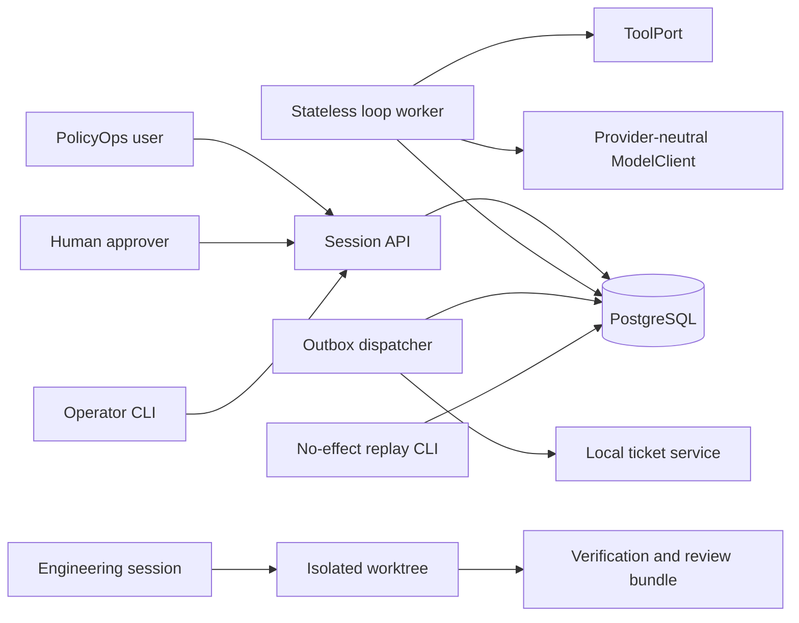
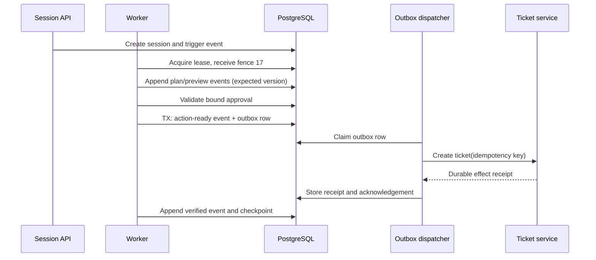

# Chapter 11 Architecture: Resumable Agent Loop

This document designs the project specified in the [Chapter 11 PRD](./prd.md). Chapter 11 owns the durable single-session execution protocol and the engineering evidence workflow. It consumes Chapter 10's chosen topology, but it does not redesign delegation, production telemetry, or fleet deployment.

## Architecture goals and invariants

1. An append-only event stream is the source for reconstructing session state.
2. A checkpoint is an optimization and recovery cursor, never an alternative history.
3. One idempotency key maps to one durable intent and at most one PolicyOps ticket.
4. Approval binds exact canonical action bytes, actor, tenant, scope, and expiry.
5. A worker may write only while its database-issued fencing token remains current.
6. Replay cannot resolve a dependency capable of producing an external effect.
7. Engineering changes and runtime actions both stop on explicit budgets and completion contracts.

## System context



The fixture profile replaces `ModelClient` with deterministic replay and the ticket service with a durable local stub. Chapter 12 will export selected events and spans; this chapter only guarantees their structure and correlation.

## Components and responsibilities

| Component | Responsibility | Explicit boundary |
|---|---|---|
| Session API | Validate request envelopes, create/resume/cancel sessions, expose state | Never executes tools inline |
| Loop worker | Claim a lease, advance validated states, classify failures, update budgets | Stateless between claims |
| Event store | Append ordered, versioned session events with optimistic concurrency | No mutable event payloads |
| Checkpoint store | Cache a verified recovery cursor and pending-action summary | Cannot override events |
| Lease manager | Issue expiring leases and increasing fencing tokens | Database-validated authority |
| Approval service | Canonicalize previews and validate approval bindings | No implicit or open-ended approval |
| Action coordinator | Persist action intent and outbox entry in one transaction | Does not call the ticket service |
| Outbox dispatcher | Deliver with stable idempotency key and reconcile acknowledgements | At-least-once delivery |
| Replay engine | Fold events into state using no-effect adapters | Read-only, offline reconstruction |
| Fault controller | Terminate workers at named protocol boundaries | Fixture/test only |
| Engineering harness | Enforce plan, allowlist, tests, direct QA, and fresh review | Separate from product runtime |

## Interfaces and contracts

Python interfaces remain provider-neutral and are pinned to concrete dependency versions only when implementation starts. Chapter 11 imports the frozen Chapter 1 `ModelClient`/`RunContext` and Chapter 9 `ToolPort`/approval contracts; it does not redefine them.

```python
from policyops.contracts import ModelClient, ModelRequest, ModelResult, RunContext
from policyops.tools import ApprovalClaims, EffectPreview, TicketEffect, TicketResult, ToolPort

# Frozen signatures used by the loop:
# ModelClient.generate(request: ModelRequest, context: RunContext) -> ModelResult
# ToolPort.preview(input: TicketEffect, context: RunContext) -> EffectPreview
# ToolPort.execute(
#     preview: EffectPreview,
#     approval: ApprovalClaims,
#     idempotency_key: str,
#     context: RunContext,
# ) -> TicketResult

class SessionEvent(BaseModel):
    schema_version: Literal["1.0"]
    session_id: UUID
    sequence: int
    event_type: str
    request_id: UUID
    trace_id: str
    tenant_id: str
    actor_id: str
    configuration_id: str
    prior_state: str
    new_state: str
    payload_ref: str | None
    occurred_at: datetime

class SessionState(BaseModel):
    session_id: UUID
    version: int
    state: str
    budget: BudgetSnapshot
    pending_action: UUID | None
    terminal_reason: str | None

class SessionCheckpoint(BaseModel):
    session_id: UUID
    event_sequence: int
    state_hash: str
    state: SessionState
    created_at: datetime

class ActionIntent(BaseModel):
    intent_id: UUID
    session_id: UUID
    tenant_id: str
    actor_id: str
    capability: Literal["ticket.create"]
    preview: EffectPreview
    idempotency_key: str
    approval_reference: str
    approval_expires_at: datetime
    configuration_id: str
    expected_postcondition: dict[str, JsonValue]

class EffectReceipt(BaseModel):
    tenant_id: str
    capability: str
    idempotency_key: str
    effect_hash: str
    external_reference: str
    status: Literal["confirmed", "reconciled", "failed"]
    observed_postcondition: dict[str, JsonValue]
    recorded_at: datetime

class EventStore(Protocol):
    async def append(
        self, session_id: UUID, expected_version: int,
        fencing_token: int, events: list[SessionEvent]
    ) -> int: ...

class EffectPort(Protocol):
    async def apply(self, intent: ActionIntent) -> EffectReceipt: ...
```

These five durable types form Chapter 11's canonical `policyops.harness` schema set and are exactly what the capstone imports. `EffectPort` is a harness-internal outbox dispatcher port. Its production adapter invokes the canonical Chapter 9 `ToolPort.execute()` with `ActionIntent.preview`, the revalidated `ApprovalClaims`, `ActionIntent.idempotency_key`, and a freshly rehydrated/authorized `RunContext`; it is not a second tool, approval, or effect schema.

The canonical pending action contains fields that survive a crash:

```json
{
  "schema_version": "1.0",
  "session_id": "uuid",
  "tenant_id": "tenant-a",
  "actor_id": "user-42",
  "action_type": "ticket.create",
  "effect_hash": "sha256:...",
  "idempotency_key": "session:step:action",
  "approval_id": "uuid",
  "approval_expires_at": "RFC3339",
  "expected_postcondition": {"ticket_count_delta": 1}
}
```

State transition commands carry `expected_version` and `fencing_token`. The database accepts an append only when both match the session and active lease records. API conflict responses include the current version but never expose another tenant's state.

## Data and storage design

PostgreSQL tables will include `sessions`, `session_events`, `session_checkpoints`, `worker_leases`, `action_intents`, `approval_bindings`, `outbox_messages`, `effect_receipts`, and `review_bundles`. `approval_bindings` stores only the immutable Chapter 9 approval reference/hash/expiry needed for replay; it is not an approval authority. Immediately before execution, the worker revalidates the binding through Chapter 9's canonical `ApprovalRecordStore` and `RevocationStore`. Tenant ID appears in every primary access path. Unique constraints cover `(tenant_id, session_id, sequence)`, `(tenant_id, capability, idempotency_key)`, and the external fixture's idempotency key.

Events store typed metadata and redacted payload references. Larger direct-QA artifacts and screenshots, if used, live in the build evidence directory with hashes in `review_bundles`. A checkpoint records the event sequence and a state hash. On resume, the worker loads the checkpoint, verifies its hash, folds later events, and falls back to a full fold if validation fails.

## Runtime sequence



If the dispatcher dies after the ticket call, the row remains deliverable. Its retry uses the same key, and the ticket service returns the original receipt. If the worker dies after checkpoint persistence, a new worker receives a higher fence, reconstructs the verified state, and continues from the next transition.

## Engineering session flow

Session A has its own state model: `inspect -> plan -> approve-scope -> change -> automated-verify -> direct-QA -> fresh-review -> accepted`. Mutation tools are unavailable in `inspect`. The plan contains an allowlist and explicit exclusions. The verifier rejects out-of-scope paths and unresolved blocking findings. The fixture can simulate the independent reviewer deterministically; a subscribed agent or second person is optional.

The machine-readable bundle will contain the base tag, plan hash, changed paths, diff hash, test commands and results, direct-QA evidence hashes, reviewer identity type, findings, disposition, and completion-contract result. It does not contain credentials or unredacted sensitive content.

## Security and trust boundaries

- The API authenticates the actor and tenant before resolving a session.
- Approval is a signed or fixture-authenticated record over canonical preview bytes. Changing any bound field invalidates it.
- Workers receive only short-lived fixture credentials for the declared services; engineering sandboxes receive no production credentials.
- Lease authority terminates at the database write predicate. A process-local lock is insufficient.
- Ticket delivery crosses an external-effect boundary and therefore uses idempotency, postcondition verification, and a receipt.
- Replay installs `RejectingModelClient` and `RejectingEffectPort`, so an accidental call fails the test immediately.
- Event and evidence exporters use field allowlists and hashes rather than blacklist-only redaction.

## Failure, recovery, and consistency

Failure classification drives behavior:

| Class | Response |
|---|---|
| Transient dependency | Retry within budget using backoff and the same intent |
| Semantic/model output | Repair once or re-plan with new evidence |
| Policy/authorization | Stop; require changed authority or scope |
| Verification mismatch | Reconcile observed state; never repeat blindly |
| Permanent input | Stop with actionable typed error |
| Budget exhaustion | Persist stopped state and escalation reason |

An outbox row and its action-ready event share a transaction. The external effect cannot share that transaction, so recovery relies on the stable key and receipt. Compensation is allowed only for actions with a declared compensator; ticket deletion is not assumed to be safe. Cancellation prevents new transitions but does not erase an already committed effect.

## Observability and evaluations

Each transition produces structured fields for session, event sequence, Chapter 1 request/trace IDs, tenant hash, actor class, configuration hash, lease fence, effect hash, retry count, budget snapshot, and outcome. No raw prompt or secret enters default telemetry. Required evaluations cover transition validity, crash recovery, duplicate delivery, approval expiry, changed preview, lease loss, replay purity, budget stop, and review-bundle completeness. Chapter 12 will map these fields to OpenTelemetry conventions and production SLOs.

## Deployment and local development

The implementation will use Python 3.12+, `uv`, FastAPI, Pydantic, pytest, PostgreSQL, OpenTelemetry-compatible instrumentation, and Docker Compose. Redis is unnecessary for the core because durable leases and outbox ownership remain in PostgreSQL. The API, worker, dispatcher, database, ticket fixture, and optional UI run as separate non-root containers. A deterministic fixture profile starts without API credentials. Hosted or local model profiles reuse `ModelClient` and all acceptance tests.

## Testing strategy

- **Unit:** state reducer, canonical preview hashing, retry classifier, budget counters, redaction.
- **Property:** legal transition sequences, idempotency-key stability, event-fold determinism.
- **Contract:** ModelClient, ToolPort, EffectPort, review-bundle schema.
- **Integration:** migrations, optimistic event append, fencing predicates, transactional outbox.
- **Fault:** process termination at every named boundary and concurrent lease claims.
- **Security:** cross-tenant lookup, stale approval, changed preview, secret scanning, sandbox policy.
- **End-to-end:** clean database, ticket creation, interruption, resume, reconciliation, and no-effect replay.

Tests use a fake clock and deterministic UUID source where timing matters. At least one integration case uses a real clock to catch assumptions hidden by the fake.

## Architecture decisions and trade-offs

- **ADR-11-01: PostgreSQL event log over a new event platform.** It keeps the chapter runnable and makes transaction boundaries visible. Fleet event infrastructure remains Chapter 14 work.
- **ADR-11-02: Transactional outbox over direct tool calls.** This adds records and a dispatcher but makes the crash-after-commit window recoverable.
- **ADR-11-03: Checkpoint plus replay over mutable session blobs.** More schema discipline yields explainable recovery and deterministic tests.
- **ADR-11-04: Database fencing over process locks.** It costs a conditional write but survives worker death and concurrency.
- **ADR-11-05: Deterministic reviewer stub in the required profile.** It keeps the lab accessible; real independent review remains a measured extension.
- **ADR-11-06: No Redis in the core.** A second state system would obscure the invariant and add recovery cases without teaching the chapter's boundary.

## Implementation sequence

1. Define schemas, reducer, transition table, fake clock, and rejecting replay adapters.
2. Build Session A's plan, allowlist, verification, direct-QA, and review-bundle gates.
3. Add event append, optimistic versioning, checkpoints, leases, and fencing.
4. Add approval canonicalization, action intents, transactional outbox, dispatcher, and receipts.
5. Implement resume, cancel, reconcile, and no-effect replay commands.
6. Add all crash faults, security cases, evidence emission, runbook, and earlier regression gates.

## PRD requirement mapping

| PRD requirements | Architecture elements |
|---|---|
| CH11-FR-001, CH11-FR-002 | Engineering state model, allowlist, review bundle |
| CH11-FR-003, CH11-FR-004, CH11-FR-005, CH11-FR-006 | State reducer, event store, checkpoints, leases, fencing |
| CH11-FR-007, CH11-FR-008, CH11-FR-009 | Approval service, action coordinator, outbox, failure classifier |
| CH11-FR-010, CH11-FR-011, CH11-FR-012 | Rejecting replay adapters, budgets, fault controller |
| CH11-NFR-001, CH11-NFR-002, CH11-NFR-003, CH11-NFR-004, CH11-NFR-005, CH11-NFR-006 | Fixture profile, typed schemas, migrations, containers, verifier |
| CH11-SEC-001, CH11-SEC-002, CH11-SEC-003, CH11-SEC-004, CH11-SEC-005, CH11-SEC-006 | Tenant keys, canonical approval, redaction, sandbox, database fence, no-effect ports |
