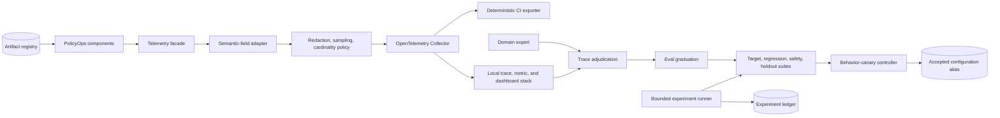
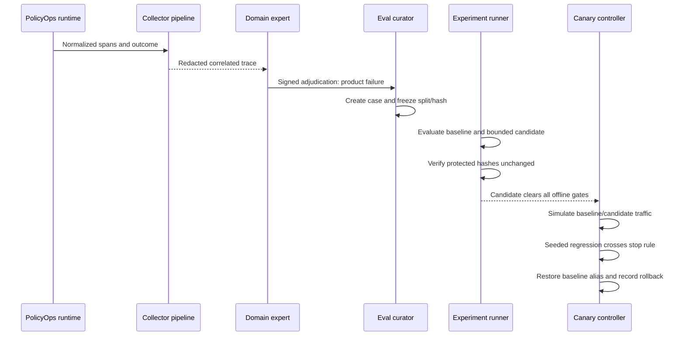

# Chapter 12 Architecture: Trace-to-Safe-Improvement Pipeline

This architecture implements the [Chapter 12 PRD](./prd.md). Its boundary starts with structured runtime signals and ends with a reviewed configuration candidate plus behavior-canary evidence. Chapter 11 owns execution replay and effect safety; Chapter 14 owns binary, schema, and infrastructure rollout.

## Architecture goals and invariants

1. Every behavior conclusion is traceable to artifact versions and an outcome.
2. Sensitive content is minimized before it crosses the telemetry boundary.
3. Framework-specific fields terminate at a semantic adapter.
4. A trace becomes an evaluation only after explicit domain adjudication.
5. The candidate may modify one declared prompt or routing surface, never its evaluator or evidence.
6. Target, regression, safety, and read-only holdout gates all precede a canary.
7. Reconstruction and analysis never invoke external effects.
8. A behavior canary has automatic stop and rollback conditions fixed before launch.

## System context



## Components and responsibilities

| Component | Responsibility | Does not own |
|---|---|---|
| Artifact registry | Immutable metadata and hashes for behavior-affecting artifacts | Artifact binary storage |
| Telemetry facade | Stable instrumentation API used by PolicyOps components | Provider-specific field names |
| Semantic adapter | Normalize model, retrieval, memory, agent, and tool signals | Redaction decisions |
| Policy processor | Allowlist, redact/hash, sample, and cap cardinality | Long-term raw-content storage |
| Collector | Buffer and route traces, metrics, and logs | Request-path success |
| Deterministic exporter | Produce canonical CI evidence | Interactive dashboards |
| Local observability stack | Support investigation and SLO views | Mandatory CI truth |
| Adjudication service | Record expert classification and graduation eligibility | Automated product judgment |
| Reconstruction service | Rebuild a decision view with rejecting adapters | Runtime state recovery |
| Eval curator | Create versioned cases and protected split assignments | Changing graders |
| Experiment runner | Evaluate one writable surface under fixed budgets | Autonomous production writes |
| Canary controller | Split simulated traffic, evaluate gates, switch or revert alias | Container deployment |

## Interfaces and contracts

Instrumentation uses a small facade so application code does not depend on a vendor SDK:

```python
class TelemetryPort(Protocol):
    @asynccontextmanager
    async def span(self, name: str, context: TraceContext,
                   attributes: Mapping[str, Scalar]) -> AsyncIterator[Span]: ...

class ArtifactRegistry(Protocol):
    async def resolve_run(self, manifest: RunManifest) -> ArtifactSetId: ...

class CandidateEvaluator(Protocol):
    async def evaluate(self, candidate: ConfigRef,
                       suite: ReadOnlySuiteRef) -> EvaluationReport: ...
```

The stable trace context includes `correlation_id`, `tenant_hash`, `actor_class`, `session_id`, `artifact_set_id`, `risk_tier`, and `sampling_decision`. Component spans add bounded enums and numeric measurements. Untrusted values are placed only in controlled evidence storage when policy permits, never copied to attribute keys or arbitrary labels.

An experiment manifest is immutable after start:

```yaml
experiment_id: exp-012
baseline: sha256:baseline
writable_surface: config/routing.yaml
candidate: sha256:candidate
trial_budget: 20
suites: [target, regression, safety, holdout]
protected_hashes:
  graders: sha256:graders
  holdout: sha256:holdout
decision_rule: all_mandatory_gates_and_target_gain
```

## Data and storage

PostgreSQL stores artifact manifests, adjudications, evaluation-case metadata, experiment manifests, trial results, canary state, and accepted-configuration aliases. Build evidence contains canonical JSON and JUnit files. The deterministic exporter writes sorted, normalized JSON Lines so CI can compare fields without relying on span arrival timing.

The local Compose profile may use a trace backend, metrics store, and dashboard UI behind the Collector. Those stores contain only policy-approved fields and have short fixture retention. Raw reviewed evidence, when needed, lives in a separate access-controlled fixture path referenced by hash. Candidate processes receive read-only mounts for graders, cases, holdouts, and evidence.

## Runtime and improvement sequence



The seeded demonstration intentionally ends with rollback. A second non-regressing fixture may demonstrate promotion, but promotion is not required to teach safe rejection.

## Security, privacy, and trust boundaries

The first trust boundary sits inside the application process: redaction and field allowlisting occur before data reaches the Collector. The Collector is not trusted to repair an unsafe application payload. Tenant IDs become keyed hashes for shared views. Detailed evidence access requires a role and audit record.

Candidates execute in a restricted subprocess or container with read-only suite mounts, no production credentials, no outbound network in the required profile, and write access only to a trial output directory. Hashes are checked before and after execution. The canary controller alone can update the accepted alias, using optimistic versioning and a short lease. Reconstruction resolves `RejectingModelClient`, `RejectingToolPort`, and `RejectingEffectPort`.

## Failure and recovery behavior

- **Collector or backend unavailable:** the in-process exporter drops or buffers within a strict limit, increments a loss metric, and never blocks the request indefinitely.
- **Redaction processor failure:** fail closed for export; retain only a local count and diagnostic code.
- **Artifact missing or hash mismatch:** mark the run unqualified for comparison and block graduation or release.
- **Expert disagreement:** quarantine the trace until resolved; do not create an evaluation case.
- **Candidate crash or timeout:** record a failed trial and revert by default.
- **Canary controller restart:** reload the active manifest and alias version; if state is ambiguous, restore baseline.
- **Rollback update conflict:** stop the canary, re-read the alias, and require operator review rather than overwrite another release.

## Observability and evaluation model

The pipeline observes itself through bounded metrics: export failures, redaction counts, dropped attributes, cardinality violations, trace completeness, adjudication queue age, experiment duration, protected-hash failures, candidate keep rate, canary stop reason, and rollback duration. SLOs use explicit window, objective, error budget, measurement query, and owner fields.

Evaluation layers are separate: component contract tests validate semantic fields; trace completeness tests validate correlation; privacy tests use canary PII and secret strings; offline suites measure target, regression, safety, latency, and cost; behavior-canary tests apply the fixed stop rule. Human adjudication is evidence, not a mutable grader inside the candidate loop.

## Deployment and local development

The project uses Python 3.12+, `uv`, FastAPI, Pydantic, pytest, OpenTelemetry, PostgreSQL, and Docker Compose. The local profile includes a pinned Collector and local dashboard services selected at implementation kickoff. CI uses only the deterministic exporter and PostgreSQL, keeping mandatory gates small and reproducible. The fixture ModelClient and graders are replay-based. An optional profile can route the same normalized data to a hosted backend through a replaceable exporter.

## Testing strategy

- **Unit:** semantic mapping, redaction, hashing, sampling, cardinality limiter, decision rules.
- **Schema/contract:** span fields, artifact manifests, adjudications, experiment ledger, canary evidence.
- **Integration:** Collector configuration, deterministic export, artifact resolution, alias optimistic update.
- **Privacy:** exact supplied PII and secrets absent from all default backends and evidence logs.
- **Mutation:** candidate attempts to modify a grader or holdout and is denied or detected by hash.
- **Resilience:** backend outage, exporter saturation, candidate timeout, canary restart, rollback conflict.
- **End-to-end:** trace to adjudication, evaluation graduation, bounded experiment, overfit rejection, bad-canary rollback.

## Architecture decisions and trade-offs

- **ADR-12-01: Internal semantic schema behind an OpenTelemetry adapter.** This preserves portability while supporting standards-oriented export; it requires maintaining one mapping layer.
- **ADR-12-02: Deterministic file exporter is CI truth.** Dashboards remain useful for humans but are not stable enough for mandatory assertions.
- **ADR-12-03: Human adjudication before eval graduation.** It slows the loop but prevents workflow noise and preference from silently redefining product quality.
- **ADR-12-04: One writable configuration surface per experiment.** It reduces search breadth and makes attribution possible.
- **ADR-12-05: Accepted alias rather than copying configuration.** Atomic pointer changes make rollback fast but require optimistic version control.
- **ADR-12-06: Behavior canary separate from deployment canary.** It avoids overlap with Chapter 14 and distinguishes a bad model behavior change from a bad container or migration.

## Implementation sequence

1. Freeze artifact, trace, span, adjudication, experiment, and canary schemas.
2. Build the facade, semantic adapter, redaction/sampling pipeline, deterministic exporter, and local views.
3. Add artifact lineage, SLO records, non-executing reconstruction, and expert adjudication.
4. Add evaluation graduation, protected mounts and hashes, bounded runner, and keep-or-revert ledger.
5. Add behavior-canary controller, automatic rollback, seeded failures, evidence output, and handoff ADR.

## PRD requirement mapping

| PRD requirements | Architecture elements |
|---|---|
| CH12-FR-001, CH12-FR-002, CH12-FR-003, CH12-FR-004, CH12-FR-005 | Artifact registry, telemetry facade, adapter, policy processor, SLO records |
| CH12-FR-006, CH12-FR-007, CH12-FR-008 | Adjudication, rejecting reconstruction, eval curator |
| CH12-FR-009, CH12-FR-010, CH12-FR-011, CH12-FR-012 | Restricted runner, protected assets, ledger, canary controller, retirement ADR |
| CH12-NFR-001, CH12-NFR-002, CH12-NFR-003, CH12-NFR-004, CH12-NFR-005, CH12-NFR-006 | Replay profile, non-blocking export, deterministic evidence, versioned schemas |
| CH12-SEC-001, CH12-SEC-002, CH12-SEC-003, CH12-SEC-004, CH12-SEC-005, CH12-SEC-006 | Pre-export minimization, tenant hashing, required evidence rules, read-only mounts, rejecting ports |
