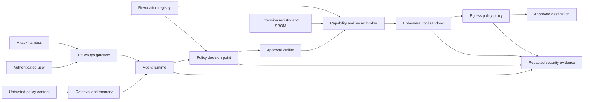
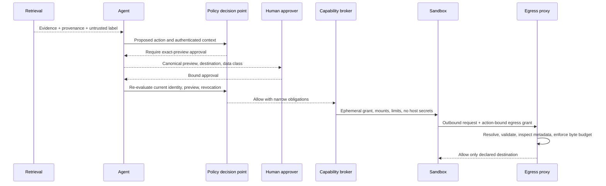

# Chapter 13 Architecture: Indirect Prompt-Injection Defense

This document designs the security project in the [Chapter 13 PRD](./prd.md). It wraps the existing PolicyOps retrieval, memory, agent, MCP, skill, plugin, hook, and tool components with enforceable controls and attacks their composition. It does not replace those components or claim a universally secure sandbox.

## Architecture goals and invariants

1. Content can supply evidence but cannot grant identity, authority, capability, approval, or destination access.
2. Identity is established before tenant data, tools, memory, sandboxes, or credentials are assigned.
3. Every external action passes independent authorization and exact-preview approval checks.
4. Private data and untrusted content never share unrestricted external communication.
5. Sandboxes receive no host or production secrets and have default-deny egress.
6. Extension and dependency integrity is verified before load and rechecked against revocation before use.
7. Security claims are limited to named controls, runtime, and supplied attack cases.

## System context and trust zones



The gateway/agent zone is not trusted to make final authorization decisions. The sandbox is hostile-by-assumption. The egress proxy does not trust sandbox DNS, redirects, headers, or payload classification. Telemetry receives only minimized security evidence.

## Components and responsibilities

| Component | Responsibility | Enforcement point |
|---|---|---|
| Provenance wrapper | Attach source, trust, tenant, authority, and integrity metadata | Context assembly boundary |
| Instruction/data separator | Preserve trusted control messages apart from untrusted evidence | Model request builder |
| Policy decision point (PDP) | Evaluate principal, action, resource, destination, data, risk, and obligations | Before preview and execution |
| Approval verifier | Bind current approval to exact canonical preview and identity | Immediately before effect |
| Capability broker | Issue narrow, short-lived grants and sandbox configuration | Runtime creation |
| Secret broker | Inject fixture credentials through non-model-visible channel | Authorized tool process only |
| Sandbox launcher | Apply user, mount, syscall, process, resource, and network restrictions | Linux container runtime |
| Egress proxy | Revalidate destination and grant; block undeclared traffic | Only outbound network path |
| Integrity verifier | Check hashes, signatures, versions, SBOM, and allowlist | Discovery/load boundary |
| Revocation registry | Deny revoked capability or artifact at discovery and use | PDP and broker |
| Security evidence adapter | Emit bounded, redacted Chapter 12 semantic events | Every decision point |
| Attack harness | Run frozen attacks and verify effects and evidence | Test environment only |

## Interfaces and contracts

Authorization is outside model output:

```python
class PolicyDecisionPoint(Protocol):
    async def decide(self, query: AuthorizationQuery) -> AuthorizationDecision: ...

class CapabilityBroker(Protocol):
    async def issue(self, decision: AllowDecision,
                    preview: CanonicalPreview) -> CapabilityGrant: ...

class EgressPolicy(Protocol):
    async def authorize(self, grant: CapabilityGrant,
                        request: OutboundRequestMeta) -> EgressDecision: ...
```

`AuthorizationQuery.from_run_context(run_context, action, resource, destination)` is the only supported identity construction path. It preserves the Chapter 1 request/trace, actor, tenant, roles/scopes, data classification, configuration, deadline, and budget fields, then adds action-specific risk and destination metadata. Chapter 13 uses the Chapter 9 `ExtensionRegistry`, `RevocationStore`, and `ApprovalRecordStore` ports; the policy layer validates them but does not create competing lifecycle stores.

The HTTP MCP authorization adapter keeps protocol authentication separate from application authorization. Its stable `2025-11-25` fixture discovers protected-resource metadata, uses authorization code with PKCE, binds tokens to the MCP resource audience, and rejects downstream token passthrough. The opt-in `2026-07-28` release-candidate fixture also validates the authorization-server issuer (`iss`) and binds registered client credentials to the issuing authorization server. Profile selection is explicit, versioned evidence; release-candidate checks cannot silently redefine the stable gate.

```json
{
  "principal": {"actor_id": "user-42", "tenant_id": "tenant-a", "roles": ["policy-reader"], "authn_strength": "fixture-mfa"},
  "action": "ticket.create",
  "resource": "policy-case/17",
  "destination": "ticket.internal:443",
  "data_classes": ["case-summary"],
  "content_trust": ["untrusted-retrieved"],
  "approval": {"id": "uuid", "effect_hash": "sha256:...", "expires_at": "RFC3339"},
  "extension": {"id": "policy-ticket", "digest": "sha256:..."},
  "budgets": {"effects": 1, "bytes_out": 4096}
}
```

Decisions return stable reason codes and obligations such as `require_approval`, `redact_fields`, `sandbox_profile`, `egress_grant`, `max_effects`, and `evidence_level`. The agent may present a denial but cannot override it.

## Content, capability, and data flow



A malicious document can suggest a tool call, but it cannot create the signed request context, approval, capability grant, egress grant, or secret-broker authorization required to execute it.

## Data and policy storage

Version-controlled policy bundles define action and destination rules, data classifications, risk tiers, sandbox profiles, and reason codes. In the production-style profile, PostgreSQL is an alternative binding for Chapter 9's canonical `ExtensionRegistry`, `RevocationStore`, and `ApprovalRecordStore`; it replaces the SQLite fixture binding one-for-one and does not mirror a second authority. Chapter 13-owned tables store security decisions, attack runs, quarantine state, and threat/control mappings. Immutable fixture files hold the attack corpus, signed extension examples, malicious packages, expected decisions, and benign ceiling.

Secrets are not stored in these tables or fixtures as reusable credentials. The test secret broker creates ephemeral canary values at run time and records only fingerprints. The SBOM and allowlist tie component name and version to an expected digest and license metadata. Evidence records link attack ID, threat ID, control ID, decision code, trace ID, and redacted result.

## Sandbox and egress enforcement

The core sandbox runs as a non-root Linux container with a read-only root filesystem, a small declared writable work directory, dropped capabilities, no privilege escalation, process and memory limits, a restricted syscall profile, and an internal-only network. The capability broker creates a fresh runtime per high-risk action or fixture group.

The egress proxy is the only routable outbound path. It rejects plaintext destinations, loopback and link-local escape targets, undeclared hosts and ports, redirects, unresolved or policy-changing DNS answers, wrong HTTP methods, oversized payloads, and grants whose action digest, tenant, expiry, or byte budget does not match. The proxy validates metadata and policy; it is not expected to understand arbitrary sensitive semantics.

## Security and trust boundaries

- **Authentication boundary:** gateway-issued identity is verified; model text and document metadata cannot supply identity.
- **Tenant boundary:** tenant predicates apply in retrieval, memory, trace, policy, approval, and tool stores.
- **Authority boundary:** system/developer controls stay in distinct message and data structures from evidence.
- **Extension boundary:** packages remain data until integrity, allowlist, trust, and revocation checks succeed.
- **MCP authorization boundary:** a valid connection token does not authorize a tool, resource, tenant, data class, or effect; resource audience, profile-specific issuer rules, and backend policy are checked independently.
- **Credential boundary:** secret broker writes ephemeral credentials directly to an authorized process channel, never model context.
- **Effect boundary:** Chapter 11 idempotency and approval checks combine with current policy and egress grants.
- **Evidence boundary:** field allowlists and fingerprints preserve auditability without copying secrets.

## Failure and recovery

Policy, identity, integrity, revocation, secret-broker, or egress dependency failure denies high-impact execution. A sandbox launch failure produces no fallback to host execution. A revoked artifact invalidates new grants and is checked again at invocation so an open session cannot rely on stale discovery. Detected attack sessions are quarantined, outstanding grants are revoked, effect delivery is paused, and Chapter 11 state remains available for safe investigation.

Incident collection freezes redacted decision records, artifact hashes, trace references, and test outputs. Recovery requires updated policy or artifact, repeat of the originating case plus regression corpus, and an explicit residual-risk update. It never resumes from the attacker-provided instruction.

## Observability and evaluations

Security telemetry uses bounded enums: action, decision, reason, risk tier, trust class, sandbox profile, destination class, integrity result, revocation state, and attack ID. Principal and tenant values are pseudonymized where dashboards are shared. No secret or raw malicious payload is exported.

Evaluations include authorization matrices, cross-tenant probes, prompt-injection and poisoning cases, approval bypass, egress escape, filesystem and syscall access, extension tampering, revocation freshness, secret canaries, duplicate effects, resource limits, prohibited-content behavior, and benign near-neighbors. Reports distinguish prevention, detection, containment, and untested residual risk.

## Deployment and local development

The project uses Python 3.12+, `uv`, FastAPI, Pydantic, pytest, OpenTelemetry, PostgreSQL, and Docker Compose. Linux containers are required because the filesystem, process, capability, and syscall controls are part of acceptance. The fixture model and identities are deterministic. Policy and SBOM tools are locked in the lab environment at implementation kickoff. No Redis is required; revocation checks use PostgreSQL plus short process-local caching whose maximum age is tested.

## Testing strategy

- **Unit:** canonical preview, policy rule evaluation, obligations, redaction, destination normalization.
- **Contract:** authorization queries, capability and egress grants, integrity records, security events.
- **Protocol security:** stable MCP audience/PKCE/no-token-passthrough tests plus profile-gated release-candidate issuer and client-registration binding tests.
- **Integration:** sandbox mounts and user, proxy routing, secret broker channel, revocation propagation.
- **Adversarial:** all frozen injection, poisoning, privilege, exfiltration, tamper, resource, and duplicate cases.
- **Privacy:** canary secret scans across prompts, outputs, logs, traces, evidence, and build artifacts.
- **Regression:** benign near-neighbor ceiling and earlier chapter functional gates.
- **Incident:** quarantine, revoke, collect, repair, rerun, and residual-risk update.

## Architecture decisions and trade-offs

- **ADR-13-01: Structural control over prompt-only filtering.** This adds platform components but gives enforceable identity, filesystem, and network boundaries.
- **ADR-13-02: Policy decision point outside the model.** Expressiveness is intentionally limited so authorization remains deterministic and testable.
- **ADR-13-03: Egress proxy plus network isolation.** Either control can fail; the combination reduces bypass paths at the cost of local setup complexity.
- **ADR-13-04: Credentials injected after authorization.** Tools cannot reason over raw secrets, but broker integration is required.
- **ADR-13-05: Recheck revocation at invocation.** Extra lookup cost avoids long-lived stale authorization; short caching has a tested upper bound.
- **ADR-13-06: Environment-scoped claims.** The supplied corpus proves named controls, not complete sandbox escape resistance.

## Implementation sequence

1. Freeze threat model, attack corpus, decision schemas, benign ceiling, and residual-risk format.
2. Add provenance/authority metadata and the identity-first policy decision point.
3. Implement approval hardening, capability broker, sandbox launcher, egress proxy, and secret broker.
4. Implement integrity inventory, SBOM, allowlists, revocation, quarantine, and evidence adapter.
5. Run the full corpus, repair failures, repeat regressions, and generate the incident and handoff packages.

## PRD requirement mapping

| PRD requirements | Architecture elements |
|---|---|
| CH13-FR-001, CH13-FR-002, CH13-FR-003 | Threat model, provenance wrapper, instruction/data separator |
| CH13-FR-004, CH13-FR-005 | Policy decision point, approval verifier, canonical preview |
| CH13-FR-006, CH13-FR-007, CH13-FR-008, CH13-FR-009 | Sandbox, egress, secret and capability brokers, integrity and revocation |
| CH13-FR-010, CH13-FR-011, CH13-FR-012, CH13-FR-013 | Attack harness, evidence adapter, quarantine and incident workflow, versioned MCP authorization tests |
| CH13-NFR-001, CH13-NFR-002, CH13-NFR-003, CH13-NFR-004, CH13-NFR-005, CH13-NFR-006 | Deterministic Linux profile, stable reason codes, fail-closed behavior, SBOM, scoped claims |
| CH13-SEC-001, CH13-SEC-002, CH13-SEC-003, CH13-SEC-004, CH13-SEC-005, CH13-SEC-006 | Tenant enforcement, trifecta break, denied access, narrow grants, secret minimization, frozen thresholds |
