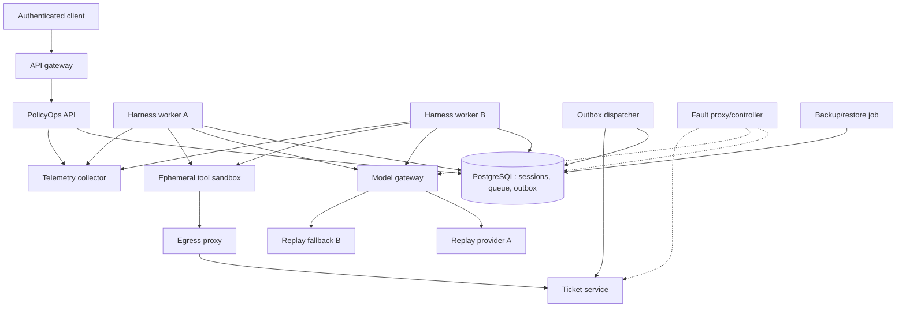
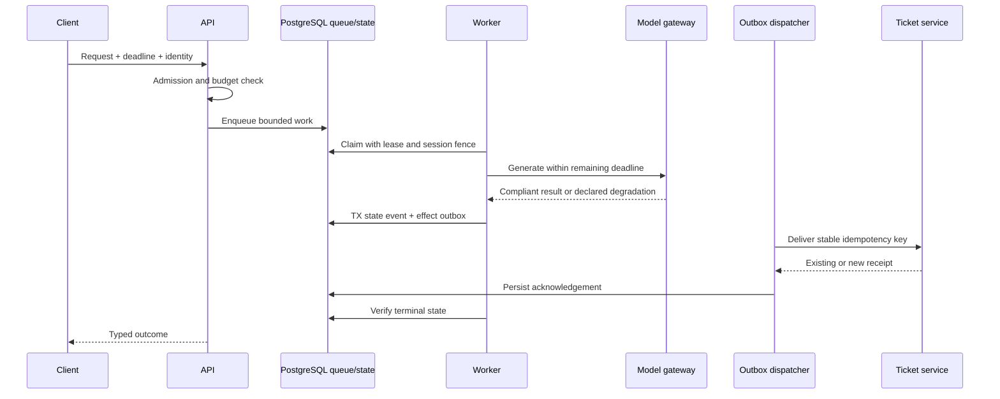

# Chapter 14 Architecture: PolicyOps Deployment and Recovery

This document designs the deployment and reliability project in the [Chapter 14 PRD](./prd.md). The core uses Docker Compose to expose process, network, queue, rollout, and recovery boundaries. Kind and Helm validate portability as an extension, not as a prerequisite.

## Architecture goals and invariants

1. Durable sessions and effects survive replacement of every stateless process.
2. Work admission is bounded before queues, workers, sandboxes, or dependencies saturate.
3. Deadlines and cancellation propagate end to end; no component invents a larger budget.
4. At-least-once delivery preserves Chapter 11's one-business-effect invariant.
5. Provider failover never silently lowers the declared capability or quality floor.
6. Behavior canaries and binary/schema/infrastructure canaries remain separate controls.
7. A backup is not accepted until an isolated restore and integrity suite succeeds.
8. Performance and recovery claims name the exact fixture, configuration, workload, and hardware.

## Deployment context



Compose networks separate ingress, control, data, tool, egress, and observability traffic. Only the gateway publishes a user-facing port. Fault injection sits on fixture dependency paths and cannot reach host services.

## Components and responsibilities

| Component | Responsibility | Scaling/failure boundary |
|---|---|---|
| API gateway | Authentication, request limits, correlation, deadline intake | Replicable, no durable state |
| PolicyOps API | Validate envelopes, admit work, report session state | Replicable, database-backed |
| PostgreSQL | Sessions, events, leases, queue, outbox, approvals, evidence index | Single core instance; backed up |
| Harness workers | Claim bounded work and run Chapter 11 state machine | Horizontally replaceable |
| Outbox dispatcher | Deliver committed effects and reconcile receipts | Replicable with row claims |
| Model gateway | Health-aware policy routing and degraded-mode decisions | Isolates provider faults |
| Sandbox launcher | Create constrained per-action runtime | Ephemeral and bounded |
| Egress proxy | Enforce Chapter 13 destination grants | Separate network choke point |
| Collector | Receive bounded telemetry and export locally | Failure cannot block requests |
| Release controller | Validate and switch accepted image/config references | Single active release lease |
| Backup/restore job | Create, catalog, verify, restore, and test backups | Isolated credentials and target |
| Fault/load drivers | Produce repeatable workload and dependency faults | Test-only profile |

## Interfaces and propagation contract

Every internal request carries a signed or trusted envelope:

```python
class ExecutionEnvelope(BaseModel):
    correlation_id: UUID
    session_id: UUID
    tenant_id: str
    actor_id: str
    configuration_hash: str
    deadline_at: datetime
    cancellation_token: str
    authorization_ref: str
    approval_ref: str | None
    idempotency_key: str | None
    budget: RuntimeBudget
```

The work queue uses a durable record rather than an in-memory broker in the core. Fields include priority class, tenant, available time, deadline, attempt count, claim owner, claim expiry, session version, and payload reference. Service-entry admission applies weighted tenant fairness, per-tenant/global concurrency, deadline feasibility, and a hard queue bound before insert. Rejection returns typed `429` plus safe `Retry-After` guidance and creates no queue row. Workers claim rows with database locking, then apply Chapter 11 fencing at every state append. This keeps the lab's correctness boundary in one transactional system. A managed broker can be evaluated later behind the same `WorkQueue` protocol.

```python
class WorkQueue(Protocol):
    async def offer(self, item: WorkItem, limits: AdmissionLimits) -> OfferResult: ...
    async def claim(self, worker: WorkerId, now: datetime) -> WorkLease | None: ...
    async def acknowledge(self, lease: WorkLease, terminal_event: EventRef) -> None: ...
```

## Data, migrations, and backup

PostgreSQL remains the durable system of record. Queue and outbox tables have bounded cleanup and indexes for available work, tenant fairness, and claim expiry. Tenant quotas are explicit rows or configuration, not inferred from current load. Large evidence artifacts remain in the build evidence volume, with hashes and required metadata in PostgreSQL.

Schema changes use expand/migrate/contract phases. The canary image must remain compatible with both the current and expanded schema during the rollout window. Destructive contract steps are separate releases after old binaries are absent. Migration preflight verifies backup freshness, available space, lock behavior, expected duration on fixtures, and rollback or roll-forward procedure.

Backups include the database, migration level, configuration and artifact hashes, and catalog. A restore job verifies checksum and catalog, restores into a new isolated database, runs migrations only when the runbook allows, executes tenant counts, referential checks, event-chain hashes, deletion tombstone/receipt checks, approval expiry, revocation freshness, and selected end-to-end queries.

## Request, queue, and effect sequence



If the deadline cannot survive expected queue delay, admission rejects the work. If it expires after claim, the worker stops before starting a new model or tool action and persists a typed state. Cancellation is cooperative for model work and mandatory before any not-yet-committed side effect.

## Failure, health, load, and recovery handling

- **Liveness:** process event loop responds; no dependency claims.
- **Startup:** configuration, policy, image metadata, and local initialization are valid.
- **Readiness:** schema compatible, database reachable, worker can participate safely, required policy loaded, and queue not in containment mode.
- **Dependency diagnostics:** authenticated operator view reports bounded status and reason codes without sensitive details.

Retries use explicit classes and full-jitter backoff within the original deadline. Circuit breakers exist per provider/tool dependency and tenant-insensitive endpoint; authorization failures never trip a shared breaker. Half-open probes use read-only fixture operations. Backpressure flows from dependency concurrency through worker claims to API admission. No retry path bypasses idempotency or approval revalidation.

## Canary, rollback, and restore flow

Container canary compares the candidate digest to the accepted digest using health, smoke, error, saturation, security-policy, and migration-compatibility gates. It does not judge answer quality changes, which remain Chapter 12 behavior-canary work. The release controller updates an accepted digest reference using optimistic versioning. A failed gate routes all traffic back, stops the candidate, and records evidence.

A restore never replaces the active database directly. It creates an isolated target, runs integrity and selected application checks, then produces an operator-reviewed promotion plan. After any restore, revocations, current approvals, retention state, and deletion evidence are reconciled before readiness can pass.

## Security and trust boundaries

Compose services run as non-root with minimal capabilities, read-only filesystems where compatible, declared resources, and restricted networks. Credentials are mounted or injected per service and omitted from image layers and evidence. The sandbox and egress controls remain those from Chapter 13. Health endpoints expose booleans and reason classes, not database addresses or stack traces. Operator actions use authenticated roles, scoped dry-run previews, and audit evidence.

Tenant identity is part of queue, state, rate-limit, trace, and credential keys. A global capacity controller may aggregate counts but cannot read tenant content. Backups and restore targets use dedicated credentials and access paths. Image digests, SBOMs, signatures, and policy results are recorded before canary start.

## Observability and SLO evidence

Key signals include admission decisions, queue depth and age, tenant fairness, active claims, deadline expiry, retry count, breaker state, worker saturation, model route, degraded mode, sandbox startup, outbox lag, duplicate receipt, effect reconciliation, canary gate, migration state, backup age, restore duration, RPO delta, and integrity result. Chapter 12 semantic fields correlate these to outcomes.

The manifest freezes the fixture workload, warm-up, duration, concurrency, payload distribution, hardware, and p95/error objectives before execution. Evidence includes raw sample summaries and configuration hashes. Results are not presented as capacity guarantees for different hardware.

## Deployment and local development

The stack uses Python 3.12+, `uv`, FastAPI, Pydantic, pytest, PostgreSQL, OpenTelemetry, Docker Compose, and a dependency fault proxy. Redis is not required for the core because the database queue shares transactional correctness with session and outbox state. Images are multi-stage, non-root, health-checked, scanned, and pinned by digest at release. Dependency and image versions are locked at implementation kickoff.

The optional Kind profile maps the same processes to Deployments, Jobs, Services, NetworkPolicies, health probes, resource limits, and persistent volumes. Helm templates are linted and rendered before cluster use. The extension must not change application contracts or mandatory fixture gates.

## Testing strategy

- **Unit:** admission, retry classification, backoff, breaker, deadline math, route policy.
- **Contract:** internal envelope, WorkQueue, ModelClient, readiness reasons, backup catalog.
- **Integration:** migrations, multi-worker claims, outbox delivery, tenant quotas, network policy.
- **Load:** frozen workload with weighted tenant fairness, service-entry `429`, queue, latency, error, saturation, and cost evidence.
- **Chaos:** kill workers/sandboxes, race claims, redeliver effects, add latency/loss, brown out providers, overlap old/new binaries, fail stores/tools, exhaust resources, and reconcile restored state.
- **Release:** unsafe migration, bad image, automatic rollback, accepted-digest verification.
- **Recovery:** corrupt-backup rejection, isolated restore, integrity, RTO/RPO, readiness reconciliation.
- **Security:** non-root images, secret scan, unauthorized network/tenant probes, SBOM and policy gates.

## Architecture decisions and trade-offs

- **ADR-14-01: PostgreSQL durable queue for the core.** It keeps session, claim, and outbox transactions visible and runnable; very high throughput may justify a broker later.
- **ADR-14-02: Compose first, Kind extension.** Readers can finish the required reliability work on a laptop while preserving a path to orchestration validation.
- **ADR-14-03: Explicit degradation over opportunistic fallback.** Availability may be lower, but quality and capability promises stay honest.
- **ADR-14-04: Separate canary types.** Container and schema safety are evaluated here; behavior changes retain Chapter 12's evidence and controls.
- **ADR-14-05: Restore to isolation.** Recovery takes longer than in-place replacement but prevents a corrupt or stale backup from becoming active.
- **ADR-14-06: Evidence-bound performance.** Portable thresholds are avoided; reproducibility and declared hardware are mandatory.

## Implementation sequence

1. Freeze topology, envelopes, manifests, thresholds, network zones, and recovery objectives.
2. Implement health states, admission, bounded queue, deadline/cancellation propagation, and tenant quotas.
3. Add replicated claims, weighted-fair admission, service-entry `429`, retry/breaker policy, provider health routing, Chapter 11 outbox redelivery/reconciliation, and load tests.
4. Add migrations, digest-pinned image canary, rollback, backups, isolated restore, and integrity checks.
5. Complete chaos matrix, runbooks, evidence output, optional Kind mapping, and capstone registration.

## PRD requirement mapping

| PRD requirements | Architecture elements |
|---|---|
| CH14-FR-001, CH14-FR-002, CH14-FR-003, CH14-FR-004 | Process/network topology, execution envelope, PostgreSQL queue, worker claims |
| CH14-FR-005, CH14-FR-006, CH14-FR-007, CH14-FR-008 | Retry and breaker policy, provider gateway, health state model |
| CH14-FR-009, CH14-FR-010, CH14-FR-011, CH14-FR-012, CH14-FR-013 | Expand/contract migrations, canary controller, backup/restore, chaos and runbooks |
| CH14-NFR-001, CH14-NFR-002, CH14-NFR-003, CH14-NFR-004, CH14-NFR-005, CH14-NFR-006 | Compose fixture, non-root digest images, evidence-bound load, config schemas |
| CH14-SEC-001, CH14-SEC-002, CH14-SEC-003, CH14-SEC-004, CH14-SEC-005, CH14-SEC-006 | Network zones, tenant keys, runtime credentials, safe health, restore reconciliation, supply-chain gates |
