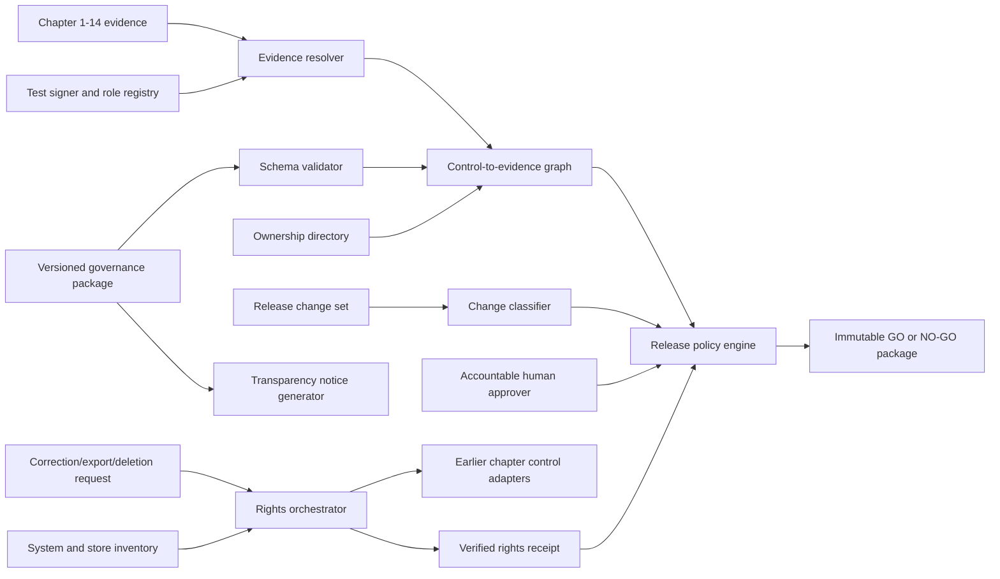
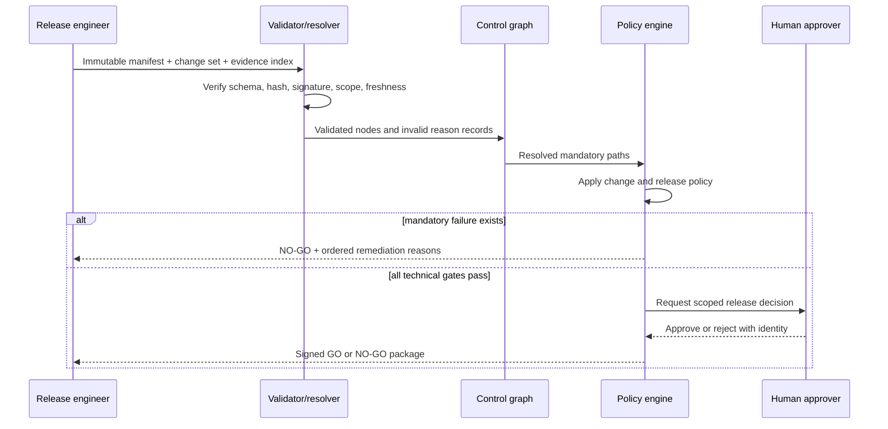

# Chapter 15 Architecture: Governance Release Gate

This document designs the governance project in the [Chapter 15 PRD](./prd.md). The governance layer indexes and verifies technical evidence; it does not replace the authorization, retrieval, memory, security, observability, deployment, or deletion mechanisms implemented in earlier chapters.

## Architecture goals and invariants

1. Machine-readable records are the source of truth; reports are generated views.
2. Every mandatory high-risk path terminates in a current accountable human owner and valid release authority.
3. Evidence is accepted only when its schema, hash, signature, signer role, scope, configuration, result, and time window all match policy.
4. Any unresolved mandatory path yields `NO-GO`; no score can average it away.
5. Technical evidence producers cannot grant themselves required independent approval.
6. Rights workflows enumerate stores from the current system inventory and cannot claim success for partial coverage.
7. Identical immutable inputs produce the same ordered reasons and decision digest.

## System context



## Components and responsibilities

| Component | Responsibility | Explicit boundary |
|---|---|---|
| Schema registry/validator | Validate versioned inventory, risk, ownership, approval, evidence, rights, and decision records | Does not judge release policy |
| System inventory | Enumerate components, identities, stores, owners, uses, limits, and rights surfaces | Does not duplicate technical configuration |
| Role and owner resolver | Verify current human owners, backups, signer and approver authority | Fixture directory in core |
| Evidence resolver | Verify artifact, hash, signature, scope, freshness, and passing result | Read-only evidence access |
| Control graph builder | Connect risk to control, implementation, test, evidence, owner, and approval | Deterministic graph construction |
| Change classifier | Map a frozen change set to affected controls and review rules | No source-code mutation |
| Release policy engine | Evaluate mandatory paths and emit stable reasons | Cannot override failed mandatory gate |
| Rights orchestrator | Call existing correction/export/deletion adapters and verify coverage | Does not implement store deletion |
| Notice generator | Render human-readable disclosure from inventory and policy | Generated output only |
| Decision packager | Canonicalize, hash, sign, and archive inputs and result | No hidden mutable inputs |

## Interfaces and governance record contracts

Pydantic models validate records at runtime, while JSON Schemas provide language-neutral CI validation. Versions are explicit and migrations preserve prior decision readability.

```python
class EvidenceRef(BaseModel):
    evidence_id: str
    control_id: str
    artifact_uri: str
    sha256: str
    schema_version: str
    configuration_scope: list[str]
    result: Literal["pass", "fail"]
    issuer: str
    issued_at: datetime
    expires_at: datetime
    signature: str

class ReleaseDecision(BaseModel):
    decision: Literal["GO", "NO-GO"]
    policy_hash: str
    manifest_hash: str
    change_set_hash: str
    evidence_graph_hash: str
    approver: str | None
    reasons: list[DecisionReason]
    decided_at: datetime
```

Core record groups include `system.yaml`, `use_cases.yaml`, `risks.yaml`, `autonomy.yaml`, `owners.yaml`, `approval_matrix.yaml`, `retention.yaml`, `controls.yaml`, `evidence-index.yaml`, `rights-policy.yaml`, and `release_policy.yaml`. IDs are stable across versions; changes create new revisions rather than silently rewriting old release evidence.

## Evidence graph and decision evaluation

The graph uses typed nodes for `UseCase`, `Risk`, `Owner`, `Control`, `Implementation`, `Test`, `Evidence`, `Approval`, `Exception`, and `Decision`. Edges have required semantics such as `MITIGATED_BY`, `IMPLEMENTED_BY`, `VERIFIED_BY`, `OWNED_BY`, `APPROVED_BY`, and `EXCEPTED_BY`. A high-risk node is releasable only when all policy-required paths resolve.

Decision evaluation proceeds in a fixed order: schema and manifest integrity; current owners; change classification; required controls; evidence cryptographic and semantic validity; test pass; approval and separation of duties; rights-request obligations; exceptions; residual risks; final human release authority. Reasons sort by policy priority and stable ID. The decision digest covers canonical inputs, ordered reasons, and result.



## Rights-request orchestration

The store inventory names an adapter and verifier for each primary and derived surface: source database, retrieval index, graph snapshot, memory ledger, cache, trace/evidence system, export package, and backup/retention process. A request first authenticates subject and tenant, records scope, then creates tasks for applicable adapters. Correction is versioned and propagated; export records sources and redactions; deletion removes or tombstones data according to policy and schedules backup expiry when immediate mutation is prohibited.

Completion requires an independent verification query per store. The receipt includes request, store inventory version, adapter result, verifier result, completion time, exceptions, retention basis, and follow-up. If one mandatory adapter or verifier fails, the request remains incomplete and the release gate can block based on policy.

## Data, signing, and storage

Governance source files live under `governance/` and are reviewed like code. Generated reports and decisions live under `build/ch15/` and are not edited by hand. Technical evidence remains in prior chapter build locations; the governance index stores references, hashes, signatures, and minimum metadata rather than copying sensitive content.

The core uses ephemeral test signing keys supplied at runtime, with distinct identities for evidence producer, rights verifier, technical approver, and release approver. Signature envelopes bind artifact hash, schema, issuer role, issue and expiry times, configuration scope, and purpose. The public fixture keys and role registry are versioned; private keys are not committed.

## Security and trust boundaries

- Governance source and release inputs become immutable for one decision run.
- Evidence is untrusted until schema, hash, signature, signer authorization, scope, time, and result checks pass.
- Owner and role resolution is independent of artifact-provided claims.
- The policy engine cannot convert `NO-GO` to `GO`; only corrected inputs and a new run can change the result.
- Rights adapters are tenant-scoped and least-privileged; the orchestrator cannot browse arbitrary store content.
- Human approver identity and separation of duties are evaluated against the current role registry.
- Archived packages contain fingerprints and minimum records, not secrets or unnecessary user content.

## Failure and recovery

A missing dependency or unreadable evidence item becomes an explicit invalid-evidence node and produces `NO-GO`. A stale clock or unavailable role directory fails closed. Partial rights execution remains resumable through per-store task state and idempotency keys, but no receipt says complete until every mandatory verifier succeeds. Duplicate rights requests return or extend the existing scoped workflow rather than deleting unrelated data twice.

Decision generation writes to a temporary directory, verifies all hashes, then atomically publishes the package. A crash before publication leaves no accepted decision alias. A published result is immutable; correction creates a superseding package linked to the prior digest.

## Observability and evaluation

Metrics include invalid records by reason, evidence age, expiring controls, owner coverage, graph resolution failures, separation-of-duties violations, release result, gate duration, rights task age, store coverage, and deletion deadline status. Sensitive subject identifiers are restricted and pseudonymized in shared views.

Tests cover schema compatibility, canonicalization, signature and role validation, expiry, wrong configuration, change classification, graph reachability, deterministic reason ordering, mandatory-gate behavior, approver separation, rights coverage, false receipts, notice consistency, and decision digest reproducibility. A release gate is evaluated as policy code, not as a language-model judgment.

## Deployment and local development

The implementation uses Python 3.12+, `uv`, FastAPI only for the optional rights UI/API, Pydantic, JSON Schema, pytest, PostgreSQL where workflow persistence is needed, OpenTelemetry, and Docker Compose fixtures from Chapter 14. The CLI and file schemas are the canonical core. A lightweight graph library may resolve the control graph in memory; a graph database is unnecessary at this scale. Dependency versions and cryptographic choices are pinned at implementation kickoff.

## Testing strategy

- **Schema:** valid and invalid fixtures for every governance record and version.
- **Cryptographic:** tampered hash, wrong key, unauthorized signer, expired and wrong-purpose signatures.
- **Policy:** owner removal, autonomy change, stale evidence, failed test, exception expiry, separation of duties.
- **Graph:** complete paths, missing edges, cycles, orphaned controls, configuration mismatch.
- **Rights:** cross-tenant denial, correction propagation, export scope, partial deletion, missed derived store, replay.
- **Determinism:** repeated runs, normalized timestamps, stable reason order, identical decision digest.
- **End-to-end:** initial `NO-GO`, authorized remediation, full rights receipt, independent approval, final package.

## Architecture decisions and trade-offs

- **ADR-15-01: Versioned files plus schemas as governance source.** They are reviewable and portable; large organizations may later add a service behind the same contracts.
- **ADR-15-02: Typed graph over checklist.** It reveals missing ownership and evidence paths, at the cost of stricter IDs and relationships.
- **ADR-15-03: Fail-closed mandatory gates.** Release availability is lower, but high-risk controls cannot disappear behind an aggregate score.
- **ADR-15-04: Generated reports.** Human documents remain consistent with source records, but manual edits must occur in structured data.
- **ADR-15-05: Rights adapters rather than centralized deletion logic.** Component owners retain correct storage semantics while governance verifies complete coverage.
- **ADR-15-06: Deterministic engine with human final authority.** Machines check evidence; accountable people frame exceptions and release.

## Implementation sequence

1. Freeze record schemas, stable IDs, signature envelope, role rules, and decision reason taxonomy.
2. Build validator, canonicalizer, owner/role resolver, and evidence resolver.
3. Build graph, change classifier, release policy evaluator, deterministic report, and decision packager.
4. Integrate rights adapters, per-store verification, receipt generation, and notice rendering.
5. Run invalid-evidence and rights drills, obtain independent fixture approval, archive the package, and register capstone handoff.

## PRD requirement mapping

| PRD requirements | Architecture elements |
|---|---|
| CH15-FR-001, CH15-FR-002, CH15-FR-003, CH15-FR-004 | Versioned records, system inventory, owner resolver, approval matrix |
| CH15-FR-005, CH15-FR-006, CH15-FR-007, CH15-FR-008, CH15-FR-009 | Evidence resolver, typed graph, change classifier, release policy engine |
| CH15-FR-010, CH15-FR-011, CH15-FR-012, CH15-FR-013 | Rights orchestrator, verified receipt, notice generator, decision packager |
| CH15-NFR-001, CH15-NFR-002, CH15-NFR-003, CH15-NFR-004, CH15-NFR-005, CH15-NFR-006 | JSON Schemas, deterministic canonicalization, fail-closed dependencies, generated views |
| CH15-SEC-001, CH15-SEC-002, CH15-SEC-003, CH15-SEC-004, CH15-SEC-005, CH15-SEC-006 | Tenant-scoped workflows, role keys, bound signatures, duty separation, verified store coverage, minimized archive |
