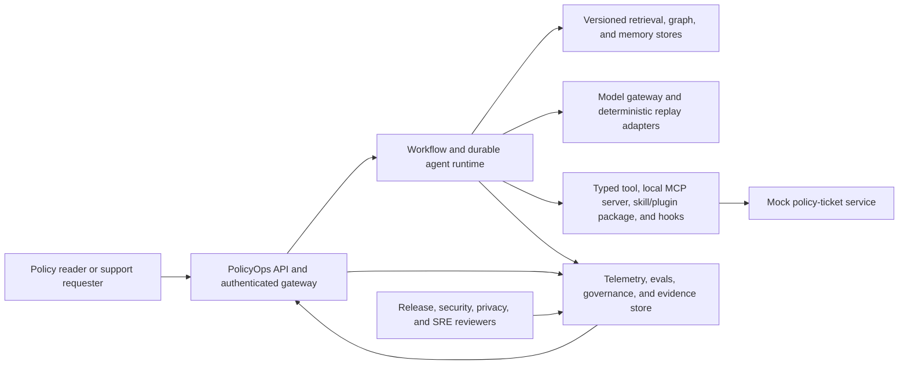
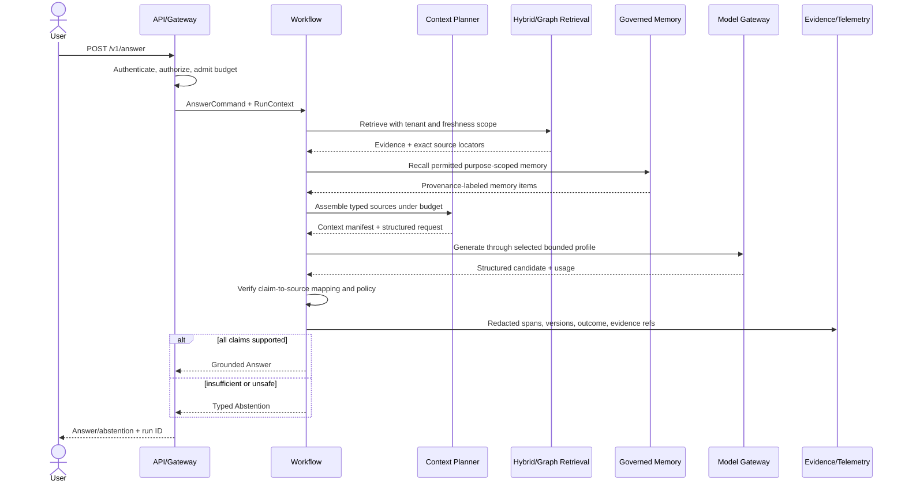
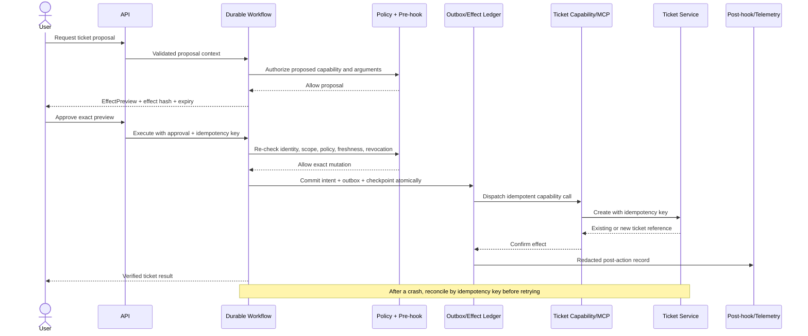

# Capstone Architecture: PolicyOps Production Agent

**Product requirements:** [Capstone PRD](./prd.md)
**Scope:** Canonical Chapter 16 implementation architecture
**Core profile:** Credential-free deterministic fixture environment on Docker Compose

## Architecture goals and invariants

PolicyOps uses a workflow-first architecture: deterministic code owns identity, authorization, policy, budgets, routing rules, joins, state transitions, approval, effects, and release gates. Models may classify, propose, extract, plan within a bounded state, or draft an answer, but model output never creates authority or directly commits a side effect.

The following invariants cross every component boundary:

1. **Identity is explicit.** Request/trace IDs, tenant, actor, roles, data classification, and configuration identity travel in the frozen Chapter 1 request envelope.
2. **Evidence is not instruction.** Retrieved text, memory, extension metadata, tool results, and user content remain provenance-labeled untrusted data.
3. **Claims are grounded or absent.** Each answer claim resolves to current accessible evidence, or the system returns a typed abstention.
4. **Memory cannot grant authority.** Recalled content may inform context but cannot add roles, capabilities, approvals, or policy.
5. **Mutation is previewed and bound.** Authorization and approval cover a canonical preview, not an intent expressed in natural language.
6. **Effects are idempotent.** Recovery may repeat computation but must not repeat the business outcome.
7. **Work is bounded.** Steps, time, tokens, spend, tool calls, result size, retries, and queue age have enforced ceilings.
8. **Every release claim has evidence.** A control without a current test result and owner cannot satisfy the release policy.

## System context



The core profile uses no external network dependency. Deterministic adapters replay model, embedding, reranking, token, and rubric-grader outputs. Optional profiles replace ports, not application contracts.

## Component model

| Component | Responsibility | State | Chapter owner |
|---|---|---|---:|
| API gateway | Authentication, request/trace correlation, deadlines, rate/budget admission | Stateless | 1, 13, 14 |
| Contract package | Versioned envelopes, answers, citations, abstentions, previews, approvals, run state, errors | Code/schema | 1 |
| Evaluation runner | Case loading, deterministic/rubric graders, repeated trials, thresholds, JUnit/evidence | Cases and results | 2 |
| Adaptation registry | Dataset/model lineage, selected baseline/adapter decision, model card and rollback | Manifests | 3 |
| Model gateway | Adapter selection, direct/enhanced paths, verification, budgets, fallback, safe cache | Cache plus config | 4 |
| Context planner | Authority ordering, source selection, sensitivity/provenance labels, compaction, token budget | Snapshots | 5 |
| Hybrid retrieval | Versioned ingestion, lexical/vector search, reranking, access filtering, citations, freshness/deletion | PostgreSQL + pgvector | 6 |
| Graph router/store | Source-linked graph snapshot, temporal/multi-hop routes, contradiction provenance | SQLite/NetworkX core | 7 |
| Memory service | Provenance ledger, derived views, consent, TTL, conflict, quarantine, correction/export/deletion | PostgreSQL | 8 |
| Capability registry | Canonical typed ticket contract, scope and lifecycle metadata | Config/registry | 9 |
| Local MCP server | Stable-profile protocol discovery/invocation around the same capability and policy boundary; application state remains explicit | Stateless transport, durable application stores | 9 |
| Skill/plugin/hooks | Workflow guidance and host packaging; pre-action denial and post-action redacted audit | Signed packages/config | 9 |
| Computer-use/browser adapter | Read fixture DOM/screen observations as untrusted data, fill the mock approval form under bounded policy, and return the final mutation to the approval-bound `ToolPort` | Fixture action trace and browser state | 10 |
| Accepted control topology | The Chapter 10-selected deterministic, single-agent, or orchestrator-worker adapter over one canonical graph; deterministic reference path remains available | Run state | 10 |
| Durable harness | Append-only events, checkpoints, leases/fencing, outbox, replay, reconciliation | PostgreSQL | 11 |
| Telemetry/improvement | Semantic spans, redaction/sampling, dashboards/SLOs, trace adjudication, experiment ledger, canary | Collector + evidence | 12 |
| Policy/containment | Capability authorization, approval verification, sandbox, egress/filesystem/secret constraints | Policy bundle | 13 |
| Deployment plane | Images, health, queues/workers, fault proxy, migration, load, canary, backup/restore | Compose volumes/images | 14 |
| Governance/release | Inventory, risks, owners, controls, evidence graph, rights receipts, release decision | Signed records | 15 |
| Capstone verifier | Traceability closure, ordered game day, evidence finalization, GO/NO-GO | Immutable bundle | 16 |

## Repository and dependency boundaries

The implementation should preserve the chapter-oriented repository paths from the outline while composing them into installable packages:

```text
src/policyops/
  api/ contracts/ adapters/ model_gateway/ context/
  retrieval/ graph/ memory/ tools/ orchestration/
  harness/ worker/ telemetry/ security/ governance/
services/
  mcp_server/ test_issuer/ ticket_stub/
schemas/ delegation/
config/ policies/ governance/ observability/
db/migrations/
deploy/compose/ deploy/kind/ deploy/helm/
evals/ tests/ fixtures/ docs/adrs/ docs/runbooks/
.github/workflows/capstone-game-day.yml
capstone/traceability.yaml
build/ch16/
```

Domain packages may depend on `contracts` and narrow ports, not on provider SDKs or deployment modules. The API calls application services. Application services call typed model, retrieval, memory, policy, event, and capability ports. Adapters point inward. The release verifier reads evidence but cannot rewrite a test result.

## Key interfaces and contracts

### Request envelope

```python
from policyops.contracts import RunContext  # exact Chapter 1 schema_version 1.0 type
```

The capstone does not redefine the envelope. It imports the Chapter 1 type with `schema_version`, request/trace IDs, tenant, actor, roles, purpose, data classification, deadline, budget, configuration ID/versions, typed authorization context, approval reference, and idempotency key. The gateway derives identity from validated credentials; clients cannot assert trusted roles. A child task receives only a signed, narrowing Chapter 10 projection. Any future field change requires a new schema version and the Chapter 1 compatibility suite.

### Model and context ports

```python
from policyops.contracts import ModelClient, ModelRequest, ModelResult, RunContext
from policyops.context import ContextItem, ContextSource, SourceSummary

# Frozen signatures:
# ModelClient.generate(request: ModelRequest, context: RunContext) -> ModelResult
# ContextSource.summaries(request: ContextRequest, run: RunContext) -> list[SourceSummary]
# ContextSource.materialize(item_id: str, run: RunContext) -> ContextItem
```

The capstone imports the frozen Chapter 1 and Chapter 5 types rather than defining structurally similar copies. `ContextItem` retains item/source kind, authority, trust, provenance, tenant, sensitivity, freshness, required/optional, stable/variable placement, token estimate, and content fields. The planner validates cheap summaries before it spends budget or exposes content, materializes only selected IDs, and revalidates every field. Chapter 6, Chapter 8, and Chapter 9 provide `EvidenceContextSource`, `MemoryContextSource`, and `CapabilityContextSource` adapters that pass the same suite.

### Grounded answer

```json
{
  "kind": "answer",
  "claims": [
    {
      "text": "Expense reports must be filed within 30 days.",
      "citations": [
        {
          "source_id": "00000000-0000-0000-0000-000000000101",
          "version_id": "00000000-0000-0000-0000-000000000202",
          "span_id": "00000000-0000-0000-0000-000000000303",
          "content_hash": "sha256:...",
          "section_path": ["Travel", "Expense reports"],
          "page": 4,
          "region": [0.11, 0.42, 0.88, 0.51]
        }
      ]
    }
  ],
  "as_of": "2026-07-10T16:00:00Z",
  "run_id": "..."
}
```

Each citation is the exact Chapter 6 `Citation` type; the capstone adds no document/version alias. The alternative is a typed abstention with reason, evidence summary, and retryability. Free-form unsupported fallback text is not allowed.

### Capability and approval

```python
from policyops.tools import ApprovalClaims, EffectPreview, TicketEffect, TicketResult, ToolPort
from policyops.extensions import ApprovalRecordStore, ExtensionRegistry, RevocationStore
```

The capstone uses the exact Chapter 9 shapes: `TicketEffect` carries tenant, title, description, severity, and source references; `EffectPreview` carries schema version, canonical effect, `effect_hash`, and impact; `ApprovalClaims` binds actor, tenant, audience, operation, effect hash, scopes, expiry, and nonce. The execute endpoint independently reloads current authorization, approval, policy, capability/revocation status, and preview inputs. The MCP server, local tool, plugin, and any host route call the same `ToolPort`. No capstone-only ticket or approval type exists.

The mandatory MCP overlay pins stable `2025-11-25`. The announced breaking `2026-07-28` release candidate is a separate opt-in compatibility overlay and cannot change the stable release gate. Contract tests version-gate transport/session behavior, Tasks/Apps, sampling/logging, schemas, and authorization. Workflow progress, approvals, idempotency, subscriptions, and resumable results remain in explicit application stores even when the chosen transport is stateless or sessionless.

### Durable run state

```python
from policyops.harness import (
    ActionIntent,
    EffectReceipt,
    SessionCheckpoint,
    SessionEvent,
    SessionState,
)
```

The capstone imports the Chapter 11 schemas and terminology. `ActionIntent` stores session, tenant, actor, action type, Chapter 9 `effect_hash`, idempotency key, approval reference/expiry, configuration identity, and expected postcondition. Events are append-only and checkpoints rebuild `SessionState`. The action-ready event and outbox row share one transaction. The unique effect key is `(tenant_id, capability, idempotency_key)`. A repeated key with a different actor, effect hash, or configuration is a typed collision and returns no stored external reference; a caller can never learn another tenant's result.

### Traceability row

```yaml
chapter: 9
component: secure_extension_pack
decision_class: mandatory_fixture
decision: implemented
source_checkpoint: ed2-v1.0-ch09-solution
artifacts:
  - path: services/mcp_server
    sha256: "..."
configuration:
  path: config/extensions.yaml
  sha256: "..."
test:
  command: "uv run policyops verify ch09 --profile fixture"
  paths: ["tests/mcp", "tests/contract"]
evidence:
  path: "build/ch16/traceability/ch09.json"
  sha256: "..."
  signature: "test-key:..."
  produced_at: "2026-07-10T18:00:00Z"
  expires_at: "2026-08-09T18:00:00Z"
rollback: "config/extensions.yaml#ticket_extension_disabled"
owner: "security-platform"
status: passed
```

The schema validator rejects unknown decision classes, missing hashes, stale evidence, invalid signatures, non-executable test entries, and status that conflicts with evidence. `decision: not_used` adds structured `adr`, `evaluation_evidence`, `selected_path`, `owner`, and `revisit_trigger` fields. It is allowed only for the PRD's optional-with-measured-no-use class and never for mandatory invariants or mandatory fixture implementations.

## Data architecture

PostgreSQL is the correctness store for tenants, actors/reference roles, policy metadata, ingestion versions, memory ledger/views, runs/events/checkpoints, leases, outbox/effect records, approvals, and governance/evidence indexes. pgvector supports the core vector index. PostgreSQL full-text search provides the lexical leg. The graph core uses a persisted, source-linked SQLite/NetworkX snapshot loaded atomically; a future graph service must satisfy the same port and lineage tests.

Object-like fixture and evidence files live in content-addressed local directories in the core profile. An immutable evidence finalization step writes a manifest of hashes and signatures. Cache entries are disposable optimizations. Cache keys include tenant, authorization scope, model, prompt/context policy, retrieval indexes, source freshness epoch, and relevant configuration. A cache outage may raise latency but cannot bypass correctness checks.

Deletion uses a registry of primary and derived stores. A deletion request creates a durable workflow, invalidates caches, removes or tombstones eligible records, rebuilds affected retrieval/graph/memory derivatives, verifies absence through each adapter, and emits a store-by-store receipt. Immutable release evidence retains only minimized non-content proof permitted by the retention policy.

## Runtime flows

### Grounded answer flow



The graph route is selected by deterministic query features and an enabled ADR/configuration. If graph evidence fails lineage, authorization, freshness, or sufficiency checks, it cannot support an answer.

### Approval-bound ticket flow with recovery



Hook timeout or failure cannot convert denial to allow. Alternate host/plugin/MCP routes converge on the same precondition checks and effect ledger.

### Release flow

The verifier loads the locked configuration and traceability manifest, checks inputs and hashes, deploys the fixture profile, runs component and integration gates, executes the PRD's numbered game day in order, verifies cleanup and recovery, evaluates current governance evidence, finalizes a new immutable bundle, and then calls the release policy. Signing occurs only after results are closed. The decision process is deterministic for the same evidence set. `.github/workflows/capstone-game-day.yml` invokes the same CLI commands and retains the signed bundle; a seeded mandatory-gate failure test proves both CI and the release decision fail closed.

## Security and trust boundaries

1. **User to ingress:** Untrusted network and request content. Authenticate tokens, derive actor/tenant/roles, validate schemas and size, rate-limit, and create the trusted envelope.
2. **Application to models:** Prompts and outputs are untrusted with respect to authority and correctness. Apply structured schemas, time/token budgets, output validation, and independent policy/grounding checks.
3. **Application to knowledge stores:** Enforce tenant and purpose filters inside the adapter/query, not after retrieval. Preserve source lineage and freshness.
4. **Application to memory:** Require a write decision, consent/purpose policy, optimistic version, and provenance. Treat recall as untrusted context.
5. **Runtime to capabilities:** Require registry allowlist, scoped authorization, exact approval, runtime identity, idempotency, network destination policy, and result verification.
6. **Host to extension package:** Verify manifest, compatibility, signature/hash, publisher allowlist, policy, and revocation before loading. Skill text and MCP descriptions never outrank system policy.
7. **Worker sandbox to host/network:** Run non-root with read-only base filesystem, explicit workspace mounts, process/resource limits, internal network, default-deny egress, runtime secret broker, and audited destinations.
8. **Production to observability/evidence:** Redact before export, bound cardinality, separate content from identifiers, restrict reviewer access, and sign finalized evidence.

The architecture breaks the combination of untrusted instructions, sensitive data, and unrestricted communication by denying unrestricted egress and preventing untrusted content from authorizing data access or tools. Residual risks include model persuasion within allowed outputs, flaws outside the tested runtime/kernel boundary, compromised trusted dependencies, and mistakes in policy ownership. Those risks stay explicit in the release record.

## Failure, recovery, and idempotency

| Failure | Required behavior |
|---|---|
| Model timeout or verifier failure | Stop enhanced path at deadline; use only a configured quality-preserving fallback or return retryable failure/abstention |
| Retrieval/graph unavailable | Do not answer from unsupported memory or cache; use valid current cached evidence only when freshness/authorization keys match, otherwise abstain |
| Cache stale or unavailable | Freshness epoch invalidates stale data; bypass cache without changing authorization or quality rules |
| Memory conflict or poison | Return explicit optimistic conflict, quarantine suspicious record, exclude it from recall, retain adjudication evidence |
| MCP/tool unavailable | Preserve approved pending intent within expiry; do not substitute an undeclared capability; retry only under policy and budget |
| Worker crash before effect | Lease expires; fenced successor replays to checkpoint and dispatches pending outbox record |
| Crash after effect before acknowledgement | Successor queries by idempotency key/external reconciliation before any retry |
| Duplicate queue delivery | Idempotency/effect ledger returns the recorded outcome; no second business effect |
| Approval/config/policy changes | Preview binding becomes stale and execution requires a new preview/approval |
| Telemetry unavailable | Buffer within a bound or continue only where policy permits; never leak raw content or block safety checks on exporter success |
| Database outage | Readiness fails; stop new admitted work; preserve bounded retries and recover from verified durable state |
| Bad image/schema/config | Canary gate fails, traffic stays on prior version, and automated rollback records evidence |
| Corrupt backup | Restore verification rejects it; retain current service or use the last verified recovery point |

Leases carry monotonically increasing fencing tokens. Any write from an older token fails. Replays suppress external-effect spans by default and use recorded results unless an explicit safe reconciliation step is required.

## Observability, evaluation, and evidence

OpenTelemetry-compatible traces cover ingress, workflow nodes, model calls, context planning, retrieval, graph, memory, policy decisions, approval, tool/MCP calls, outbox, ticket verification, and rights workflows. Required low-cardinality fields include request/trace/run IDs, tenant pseudonym, component, operation, outcome, error class, model/config/prompt/index/policy/extension versions, budget consumption, approval decision ID, and evidence references. Raw prompts, secrets, full policy content, and sensitive memory are excluded from default telemetry.

The evaluation system layers:

- contract/schema and deterministic business-rule checks;
- retrieval recall/nDCG, citation resolution, freshness, authorization, and abstention checks;
- graph temporal/multi-hop/lineage checks;
- memory lifecycle, isolation, benchmark, and rights checks;
- tool/MCP/approval/idempotency and orchestration trajectory checks;
- adversarial security and benign-neighbor false-positive cases;
- load, SLO, queue, recovery, rollback, backup, and restore checks;
- calibrated rubric grading only where deterministic grading is insufficient.

An adjudicated failed trace may create a new evaluation case only after content minimization, labeling, provenance, and review. Candidate prompt/routing changes are versioned, compared across repeated target cases and the read-only hashed holdout, and sent to a behavior canary. The system reverts on a seeded regression. A replay can never execute a live effect.

## Deployment and local development

The required Compose topology contains separate API, stateless workflow worker, PostgreSQL/pgvector, model-gateway adapter, local MCP/ticket services, OpenTelemetry collector, local metrics/trace UI, and a fault proxy. Services run on internal networks with explicit egress. Only the API and local observability UI expose development host ports. Images run non-root, use read-only roots where possible, declare health checks, and are pinned by digest in release evidence.

One `uv`-managed CLI controls environment lifecycle:

```text
uv sync --frozen
uv run policyops env up --lab ch16 --profile fixture
uv run policyops verify ch16 --profile fixture --all \
  --junit build/ch16/junit.xml --evidence build/ch16
uv run policyops fault ch16 --scenario all
uv run policyops release decide --evidence build/ch16
uv run policyops env down --lab ch16
```

The implementation must verify teardown even after failed scenarios. The optional Kind/Helm profile reuses digest-pinned images and adds workload identity, network policy, secrets integration, schema/binary/infrastructure canaries, and independent restore evidence. Hosted model, remote MCP, and independent A2A profiles remain separate configuration overlays.

## Testing strategy

1. **Contract tests:** Every model adapter, retrieval/graph/memory port, local tool/MCP transport, ticket stub, and evidence writer satisfies the same typed contract; MCP stable and opt-in release-candidate profiles are isolated and explicit application state survives transport/session replacement.
2. **Unit and property tests:** Canonicalization, budgets, cache keys, authority ordering, policy, citation ranges, state transitions, approval binding, idempotency, redaction, and release rules.
3. **Migration tests:** Forward/backward compatibility, rollback where supported, fixture upgrades, and deletion/rebuild behavior.
4. **Integration tests:** Answer and action vertical slices with PostgreSQL, MCP, ticket stub, collector, and fault proxy.
5. **Concurrency/fault tests:** Competing memory updates, lease fencing, duplicate delivery, every effect crash window, dependency outage, saturation, and network faults.
6. **Evaluation suites:** Deterministic fixture cases on every pull request; repeated/rubric/hardware/provider suites on declared schedules.
7. **Security tests:** Attack corpus, extension integrity/revocation, secret canaries, egress/filesystem denial, policy bypass, alternate routes, resource limits, and benign near-neighbors.
8. **Operations tests:** Load, SLOs, canaries, migration safety, rollback, backup validation, restore, RTO/RPO, and clean teardown.
9. **Governance tests:** Schema validation, owner/evidence expiry, signature/tamper checks, autonomy change, correction/export/deletion, and deterministic release decision.
10. **End-to-end game day:** The numbered Chapter 16 scenario matrix, with each prerequisite, injected fault, expected result, cleanup, requirement, and chapter evidence recorded.
11. **CI parity and negative control:** Compare local command fingerprints with `.github/workflows/capstone-game-day.yml`, retain CI evidence, and seed one mandatory failure that must make the job and release decision fail.

Pull-request tests must fit the fixture profile and fail closed. Long-running or hardware-specific evidence is labeled, scheduled, and retained but cannot replace core gates.

## Architecture decisions and trade-offs

| Decision | Choice | Trade-off |
|---|---|---|
| Control style | Deterministic workflow with bounded model nodes | More explicit engineering, but inspectable transitions and enforceable limits |
| Model integration | Provider-neutral port plus deterministic replay | Less access to provider-specific features at the core boundary, but credential-free reproducibility |
| System store | PostgreSQL for correctness-critical state | Heavier than in-memory/local files, but supports transactions, concurrency, outbox, and recovery |
| Hybrid retrieval | PostgreSQL FTS + pgvector in core | Not the largest-scale option, but one reproducible store and transactional freshness |
| Graph | Local source-linked snapshot behind a port | Constrained scale, but simple setup and measurable justification before external graph infrastructure |
| Memory | One provenance ledger with derived views | Additional derivation work, but correction/deletion/concurrency are auditable |
| Capability exposure | One application service surfaced as tool and MCP | Some adapter work, but prevents protocol-specific policy drift |
| Skills/plugins/hooks | Guidance and lifecycle wrappers, never authority | Less host-specific magic, but security decisions remain centralized and testable |
| Control topology | Use the accepted Chapter 10 ADR behind the Chapter 11 harness; multi-agent/A2A remains optional | Preserves measured topology choice without duplicating durability or forcing delegation where no boundary exists |
| Durable effects | Transactional outbox + idempotency + reconciliation | More state and tests, but crash safety and effectively-once business outcomes |
| Cache | Optimization only, fully scoped keys | Lower hit rate than broad caching, but no tenant/config/freshness leakage |
| Release | Evidence-driven fail-closed GO/NO-GO | More NO-GO outcomes when evidence is incomplete, which is the intended safety property |

## Implementation sequence

1. Import and validate chapter contracts, manifests, hashes, migrations, and traceability rows.
2. Establish the shared request envelope, error taxonomy, configuration registry, and evidence writer.
3. Integrate the read-only answer path: model gateway, context planner, hybrid retrieval, graph decision, citation verifier, and abstention.
4. Integrate governed memory and prove isolation, conflict, TTL, correction, export, and deletion before feeding recall into context.
5. Integrate the canonical ticket service, typed tool, local MCP adapter, skill/plugin packaging, hooks, policy, preview, and approval.
6. Import the accepted Chapter 10 topology and canonical state graph, retain the deterministic comparison/fallback path, and place that topology behind the Chapter 11 event, lease, checkpoint, outbox, idempotency, and reconciliation harness.
7. Add semantic telemetry, evaluation evidence, trace-to-eval workflow, holdout, behavior canary, and rollback.
8. Apply containment, extension verification, runtime identity, secrets, egress, filesystem/process limits, and the attack suite.
9. Assemble the Compose deployment, health/readiness, queue bounds, load/fault profiles, canary, rollback, backup, and restore.
10. Complete governance records, rights workflows, evidence graph, release policy, game-day automation, and immutable bundle finalization.

Each step must keep earlier fixture gates green and record an ADR plus rollback when integration changes a chapter contract.

## PRD requirement mapping

| PRD requirements | Architecture realization |
|---|---|
| CAP-FR-001-003 | Traceability schema, verifier, immutable evidence finalization, deterministic release policy |
| CAP-FR-004-006 | Trusted request envelope, model gateway, typed context sources and planner |
| CAP-FR-007-008 | Versioned hybrid/graph stores, access/freshness enforcement, citation verifier, typed abstention |
| CAP-FR-009 | Provenance memory ledger, derived views, lifecycle policy, user inspector/rights workflow |
| CAP-FR-010, CAP-FR-010A, CAP-FR-011 | Canonical Chapter 9 ToolPort, tool/MCP adapters, signed extension packaging, hooks, mandatory fixture computer-use/browser adapter, effect hash and approval binding |
| CAP-FR-012-013 | Accepted Chapter 10 topology over the Chapter 11 harness, scoped delegation where selected, append-only events, leases, checkpoints, outbox, idempotency, reconciliation |
| CAP-FR-014-015 | Layered eval runner, semantic telemetry adapter, experiment ledger, immutable holdout, canary/revert path |
| CAP-FR-016 | Policy engine, sandbox/egress boundaries, supply-chain verification, attack harness |
| CAP-FR-017 | Digest-pinned Compose topology, bounded queues, health, fault proxy, migration/canary/rollback/backup/restore |
| CAP-FR-018-019 | Governance evidence graph, correction/export/deletion coordinator, ordered game-day runner, GO/NO-GO record |
| CAP-NFR-001-008 | Fixture adapters, isolation filters, budget controller, recovery design, portable profile, ports, signed evidence, runbooks |
| CAP-SEC-001-009 | Repeated authorization, exact approval, extension integrity/revocation, secret broker, containment, rights policy, idempotency, SBOM, residual-risk record |
